# Exercise 02 - Deploying the Workflow tools

In this exercise, you'll import a complete project into your IDE, build it, and deploy it to your Cloud Foundry (CF) "dev" space in the organization associated with your SAP Cloud Platform subaccount. This project contains everything you need to have a Fiori launchpad (FLP) site set up for you using the Portal service, and have injected into it tiles appropriate for accessing the Workflow related tools which you'll be using throughout the rest of this Virtual Event.


## Steps

After completing these steps you'll have an FLP site with, amongst other things, an app for viewing and processing Workflow items ("My Inbox") and a "Workflow Monitor" app for monitoring, starting and interacting with workflow definitions and instances.


### 1. Download the project ZIP file

The GitHub repository [SAP-samples/cloud-process-visibility](https://github.com/SAP-samples/cloud-process-visibility) contains a number of release artifacts. It's from here that you can download the project which contains all you need.

:point_right: Jump directly to the repository's [1.0.0 Release](https://github.com/SAP-samples/cloud-process-visibility/releases/tag/1.0.0) page and download the [BPMServicesFLP.zip](https://github.com/SAP-samples/cloud-process-visibility/releases/download/1.0.0/BPMServicesFLP.zip) file.

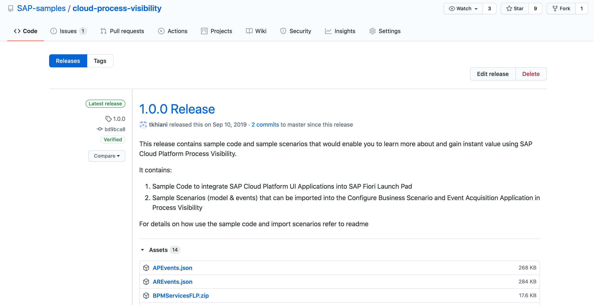

Once you have the ZIP file downloaded, unpack it into its own "BPMServicesFLP" directory. Here's what that looks like on a local computer:

```
i347491@C02CH7L4MD6T [~/Downloads]
▶ tree
.
├── BPMServicesFLP
│   ├── BPMFLP
│   │   ├── README.md
│   │   ├── package.json
│   │   ├── portal-site
│   │   │   ├── CommonDataModel.json
│   │   │   ├── business-apps
│   │   │   │   └── business-rules.json
│   │   │   └── i18n
│   │   │       ├── defaultCatalogId.properties
│   │   │       ├── defaultGroupId.properties
│   │   │       └── workflow.properties
│   │   └── xs-app.json
│   ├── BPMServicesFLP_appRouter
│   │   ├── package.json
│   │   └── xs-app.json
│   ├── mta.yaml
│   └── xs-security.json
└── BPMServicesFLP.zip

6 directories, 13 files
```

### 2. Bring the project into App Studio

It's easy to bring such a project into your App Studio Dev Space. First, you need to make sure that you have a workspace opened in the Explorer. Then, you just need to drag the project folder into there.

:point_right: Switch to the Explorer perspective in App Studio using the folders icon in the far left hand side, and use the Open Workspace button to select and open the "projects" directory.

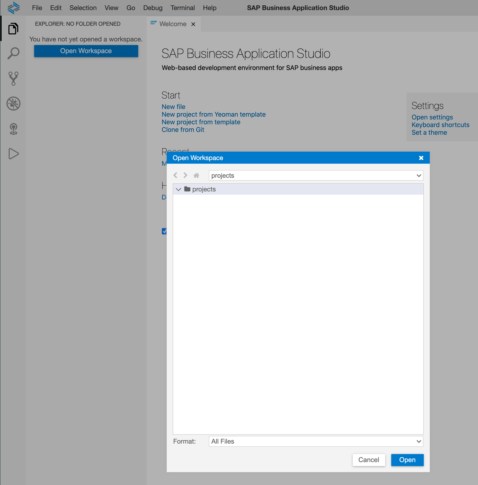

> The App Studio gives you a local filesystem to work within; it even has a Terminal that you can start up, to navigate that filesystem and run commands.

:point_right: Using your local computer's file system tools, find and drag the "BPMServicesFLP" directory into the Explorer space in the App Studio, and expand it. You should end up with something that looks like this:

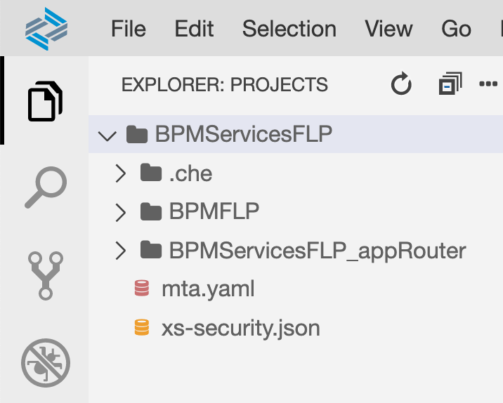


### 3. Explore the project contents

What is there in this project? What are the different files and directories? What's going to happen next? It's worth taking a couple of minutes to [stare](https://langram.org/2017/02/19/the-beauty-of-recursion-and-list-machinery/#initialrecognition) at the contents of this project to understand some details of what we're about to deploy.

:point_right: Take a look through the file and directory structure, which you can see by navigating it in the Explorer perspective (you can also see the details in the tree structure above).

Here's what you'll see, in an order that will hopefully make sense:

> In case you're left still wondering - the `.che/` directories are specific to the IDE itself, we can safely ignore those at this level of exploration.

**File: `mta.yaml`**

The `mta.yaml` file within the project contains the definitions of the modules that will be deployed to SAP Cloud Platform, and also a specification of the resources upon which these modules rely. There are two modules defined:

|Module|Description|
|-|-|
|`BPMFLP`|When deployed, this module will cause application and tile definitions to be added to the FLP site. The module itself is to be found in the `BPMFLP/` directory in the project structure. It relies upon instances of a number of services, including the Workflow and Portal services. This module executes as a one-time [task](https://blogs.sap.com/2019/05/01/cloudfoundryfun-4-fetch-football-scores-periodically/), and stops upon completion. Keep this in mind when you look at the applications in the SAP Cloud Platform Cockpit later on - it will be in a "Stopped" (i.e. completed) state.
|`BPMServicesFLP_appRouter`|This is the Approuter-based module that handles traffic to and serves the FLP site and apps within it. It relies upon instances of the same services as the `BPMFLP` module, plus another one - the HTML5 Application Repository service.|

**File: xs-security.json**

This file contains the parameters that are relevant when creating an instance of the Authorization & Trust Management service (also known as "xsuaa"); in the `mta.yaml` file, the definition of the resource `uaa_bpmservices` (upon which both modules rely) includes a reference to this file.

**Directory: `BPMFLP/`**

This directory contains the files for the `BPMFLP` module. Taking a brief look inside, we see that it's a Node.js based module, where (by looking in the `package.json` file) we see that content is deployed by means of the `@sap/portal-cf-content-deployer` package. The content itself is to be found defined in the `portal-site/` subdirectory.

**Directory: `BPMServicesFLP_appRouter`**

Not unexpectedly, this directory contains the files for the `BPMServicesFLP_appRouter` module. Looking inside this directory's `package.json` file, we see that the `@sap/approuter` is employed. The `xs-app.json` file is what the Approuter uses to know what to serve, and how.


### 4. Build the MTA archive ready for deployment

While the project contents are fascinating, they aren't going to do you much good just sitting there in the IDE. So now it's time to get everything up into the cloud. The project is in the form of a Multi-Target Application, or MTA for short; this is why the `mta.yaml` file is at the heart of everything here. To bring the project contents to the Cloud Platform, you'll first need to build an archive containing the project contents, and then deploy that archive. This step is where you build the archive.

:point_right: Use the context menu on the `mta.yaml` file in the Explorer, and select "Build MTA".

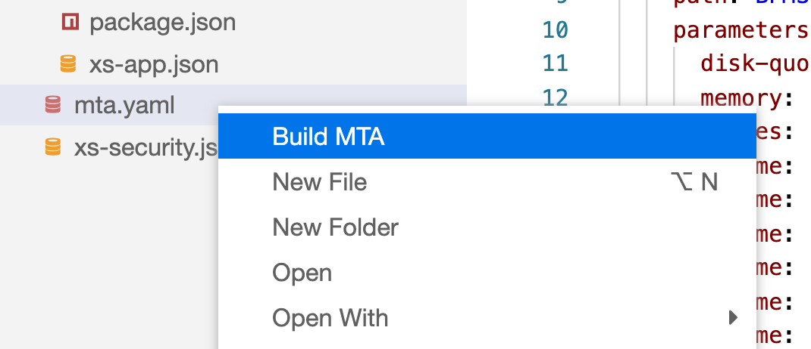

A task window will open up showing you the progress of this build task. You can see the exact command that was invoked, right at the top:

```
mbt build -s '/home/user/projects/BPMServicesFLP'; sleep 2;
```

Towards the end of the process you'll see progress log records that look like this:

```
[2020-07-16 13:34:13]  INFO generating the MTA archive...
[2020-07-16 13:34:14]  INFO the MTA archive generated at: /home/user/projects/BPMServicesFLP/mta_archives/BPMServicesFLP_0.0.1.mtar
```

:point_right: Look in the Explorer, and you'll see that an archive file, with an `mtar` extension, has been generated and placed in a new `mta_archives/` directory. This archive file is what is to be deployed in the next step.


### 5. Deploy the MTA archive to Cloud Platform

At this stage you're ready to deploy the project contents, in the form of the archive that has just been built, to the CF environment of your Cloud Platform trial account.

:point_right: Use the context menu on the `mtar` file and select "Deploy MTA Archive".

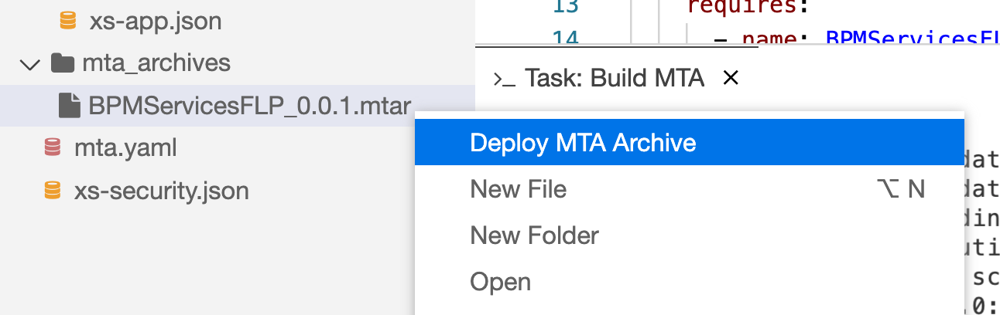

Because you've already connected your App Studio Dev Space "Workflow" to your Cloud Foundry organization and space, the deployment should start immediately. Again, as well as the progress, the task window shows you the command that was invoked:

```
cf deploy /home/user/projects/BPMServicesFLP/mta_archives/BPMServicesFLP_0.0.1.mtar
```

After a short time the deployment will complete, and you should see a log message in the output like this, towards the end:

```
Application "BPMServicesFLP_appRouter" started and available at "898789e9trial-dev-bpmservicesflp-approuter.cfapps.eu10.hana.ondemand.com"
```

This is the URL of the `BPMServicesFLP_appRouter` module that has been deployed, and will be specific to your Cloud Platform trial subaccount. You can use this URL to get to the FLP site, but instead, let's take another, slightly more long winded but definitely more interesting route.


### 6. Find the FLP site URL and get to the Workflow tiles

In the final step in this exercise, you should get to the Workflow tiles in the FLP site.

:point_right: In a new browser tab, use the Trial Subaccount Home bookmark you saved earlier to get back to your subaccount overview. You should now see, in the "Spaces" section, that there are a couple of applications, and yet more service instances.

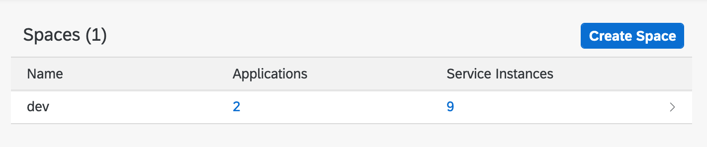

:point_right: Use the "Spaces" menu item on the left hand side to jump to the summary of spaces, and you'll also see a similar reflection of reality, where memory and service quota have been consumed, and there are two applications, one started and one stopped:

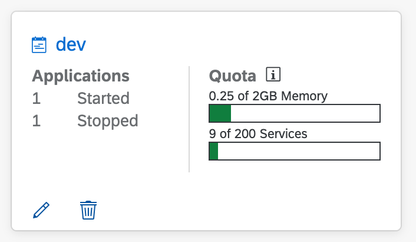

> The number of service instances that you will see may be different to what is shown in this screenshots. There should be 7 in total now that are related to this Virtual Event.

:point_right: Select the "dev" space and you should be brought initially to the list of applications. There you should see entries for the two modules defined in the `mta.yaml` file earlier - `BPMFLP` and `BPMServicesFLP_appRouter`. As expected, the `BPMFLP` application is in a "Stopped" state, as the task that it carried out completed.

:point_right: Now select the "Service Instances" menu item (a subitem within "Services" in the left hand side menu), whereupon you will be shown not only the service instances you saw earlier, but also two more, reflecting the HTML5 Application Repository service and the Authorization & Trust Management service.

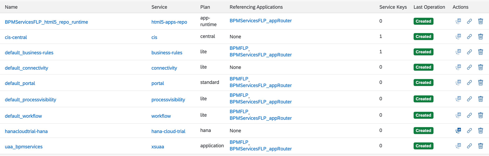

:point_right: From here, select one of the `BPMServicesFLP_appRouter` links in the "Referencing Applications" column to quickly jump to the details of that application; it will take you initially to the "Service Bindings" section:

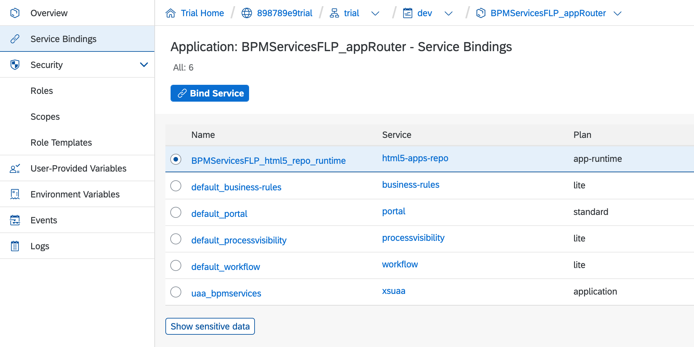

:point_right: From there select the "Overview" menu item to see general information about the `BPMServicesFLP_appRouter` application, which includes the "Application Routes" section. There's a single route URL shown for this application, and yes, you guessed it, it's the one shown in the deployment log earlier:

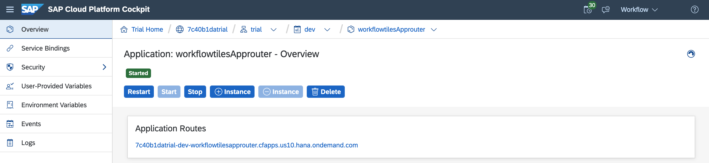

You're almost there!

:point_right: Select the route URL and, after any standard authentication challenge screen which you must complete using your SAP Cloud Platform trial email address and password, you'll see what you've been waiting for this whole time - a lovely Fiori launchpad site with the "My Inbox" and "Monitor Workflows" tiles:

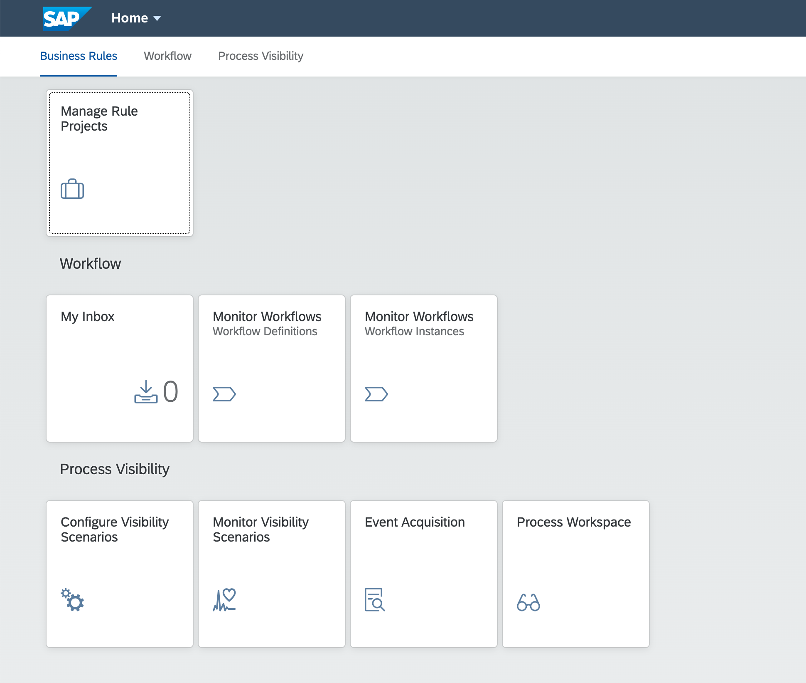

Not only that, but as a reward for coming such a long way round (just kidding), you also get tiles for Business Rules and Process Visibility apps. How about that!


## Summary

Not only do you have an instance of the main workflow service now, but also access to your own FLP site with the "My Inbox" app for managing workflow related task items, and a pair of apps for managing workflow definitions and instances. But you also have some insight into how MTAs work and what the relationship is between modules and resources defined in MTA descriptor files.

Good work!

## Questions

1. Why is the `BPMFLP` app not listed in the "Referencing Applications" column for the instance of the html5-apps-repo service?

2. What do you think the difference between a "workflow instance" and a "workflow definition" is?

3. What are all the services upon which the BPMFLP module relies?
