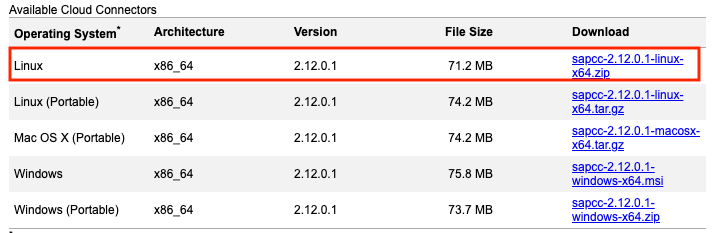
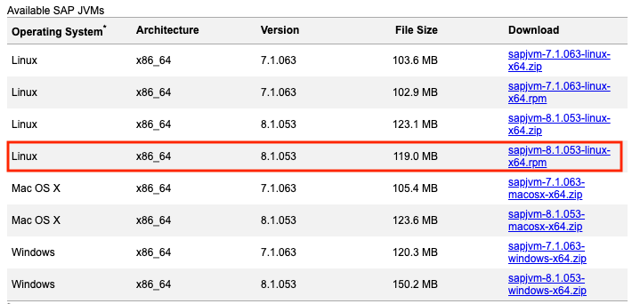
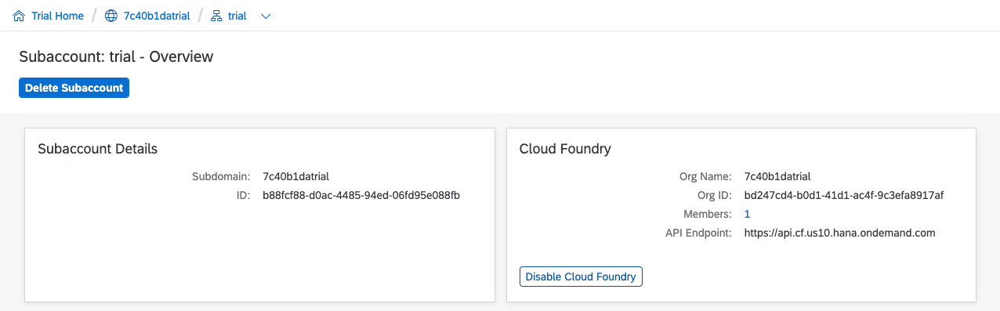
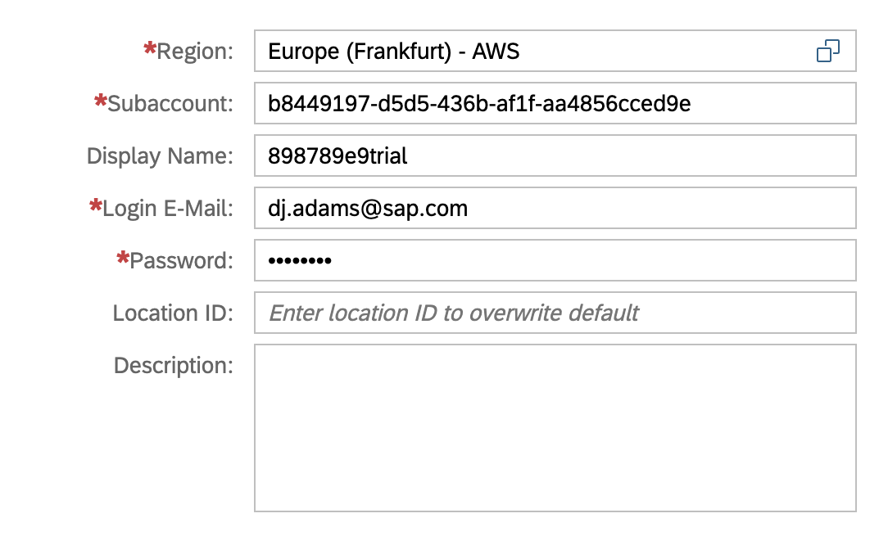
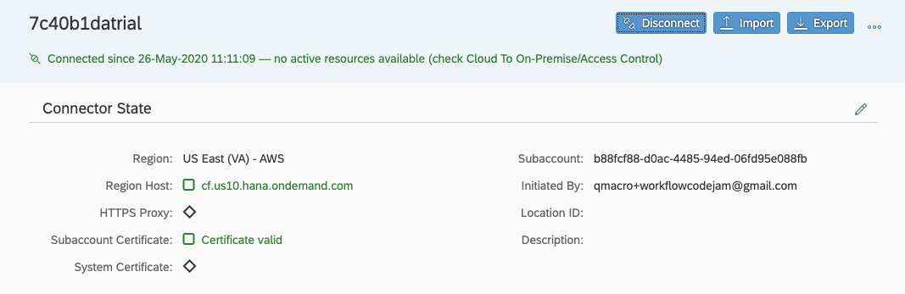
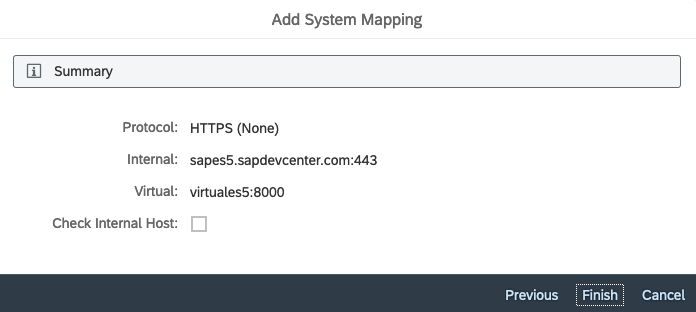
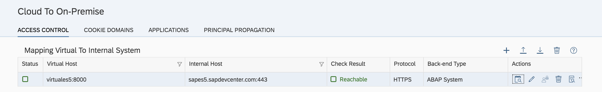
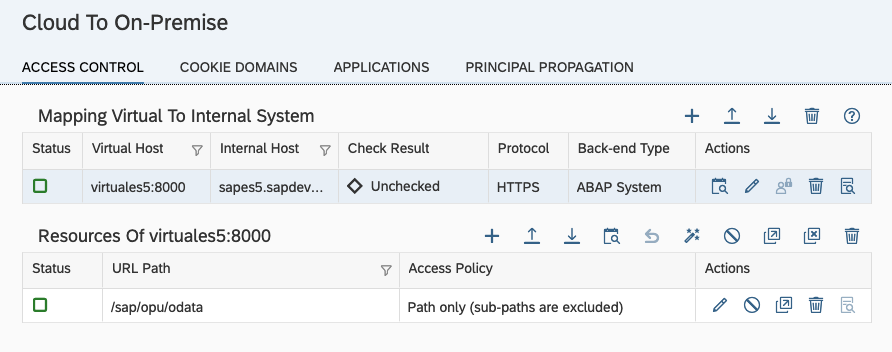
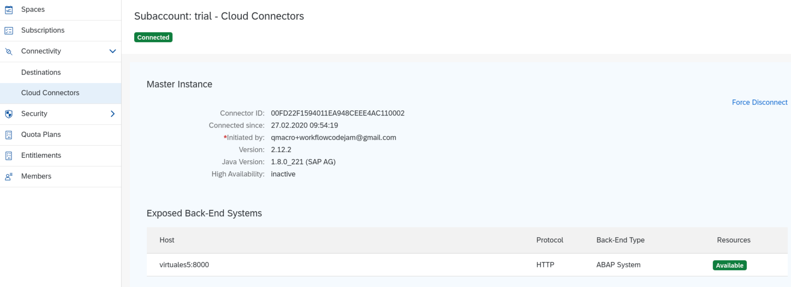

# Exercise 03 - Installing & configuring the SAP Cloud Connector

The scenario upon which this Virtual Event is based includes access to an on-prem SAP system, for which the SAP Cloud Connector is required.

> The SAP system we'll be using is not actually on-prem, it's the [public SAP NetWeaver Gateway Demo system](https://blogs.sap.com/2017/06/16/netweaver-gateway-demo-es5-now-in-beta/), known by its System ID "ES5". But for the purposes of understanding and configuring the SAP Cloud Connector, we will treat it as if it is.

In this exercise you'll set up SAP Cloud Connector, to provide the connection between an on-prem SAP system (ES5) and your subaccount on the SAP Cloud Platform, enabling services and apps running in that subaccount to access specific system endpoints in ES5.

The setup will be done in a container, to isolate SAP Cloud Connector and the software upon which it relies. This is a good approach not only for Virtual Event scenarios like this where attendees' machines are all different, but also for use within work environments. Docker will be used as the container system.

> The following instructions are based in part on the [nzamani/sap-cloud-connector-docker](https://github.com/nzamani/sap-cloud-connector-docker) repository on GitHub. If you want to find out more, check out the blog post "[Installing SAP Cloud Connector into Docker and connecting it to SAP Cloud Platform](https://blogs.sap.com/2018/05/22/installing-sap-cloud-connector-into-docker-and-connecting-it-to-sap-cloud-platform/)" by [Nabi Zamani](https://people.sap.com/pars.man#overview).

> This exercise assumes you don't already have any processes listening for HTTP requests on port 8443 of your machine.

## Steps

After completing these steps you'll have an SAP Cloud Connector system running in a container on your machine.

### 1. Prepare the environment for the Docker image

:point_right: Create a new directory called `container-scc/` (for example, in your home directory) and within that directory create a subdirectory called `sapdownloads/`.

The `container-scc/` directory will contain the build instructions for the Docker image that the container will be based upon, and the appropriate software to run the SAP Cloud Connector within it.

:point_right: Go to the [cloud section of the SAP Development Tools website](https://tools.hana.ondemand.com/#cloud) and download the latest Cloud Connector component, placing it into the `sapdownloads/` directory. Regardless of your local machine's operating system, you will need to download for Linux, as that is what the container will be running. At the time of writing the version is 2.12.0.1 - make sure you download the ZIP file for Linux as indicated, taking the latest version:



:point_right: From the same page, now download the latest SAP Java Virtual Machine (JVM) into the `sapdownloads/` directory, again for Linux, and specifically the `.rpm` component, as indicated:



> the screenshots here are for illustration purposes - the version numbers of the SAP Cloud Connector and SAP JVM components will most likely be different to the ones you see here.

:point_right: Finally in this step, create a new file called `Dockerfile` in the `container-scc/` directory (noting the capitalization and lack of extension on this file name).

:point_right: Into this file, copy the contents of the [`Dockerfile`](Dockerfile) in this repository.

Here's a quick illustration of what you should have, from a directory and file point of view (again, the version numbers may differ):

```
.
├── Dockerfile
└── sapdownloads
    ├── sapcc-2.12.0.1-linux-x64.zip
    └── sapjvm-8.1.053-linux-x64.rpm
```

### 2. Build the Docker image

Now you have everything ready to build the Docker image that will enable you to instantiate a Linux-based container running the SAP Cloud Connector. The `Dockerfile` contains instructions to build that image, and are briefly as follows:

- base the image on the [CentOS](https://www.centos.org) Linux distribution (which has a reasonably small footprint)
- on top of the base image install some core tools
- copy across, from the host (your machine) to the image, the two files you downloaded (the SAP JVM and the SAP Cloud Connector component)
- unpack and install the SAP JVM and SAP Cloud Connector
- set up a shell & user (`sccadmin`) and instructions to start up the SAP Cloud Connector for when a container is created

So now you must build the image, and after that you can instantiate a container from that image.

:point_right: In the `container-scc/` directory (where the `Dockerfile` file is located), build the image as follows:

```bash
docker build -t scc .
```

(don't forget the period at the end, denoting "this directory".)

> the build process may take a few mins, as components that make up the image need to be downloaded and then installed.

You can look for the image that's produced, with the following command:

```bash
docker image ls
```

The output will look something like this (you may have fewer entries), showing the new "scc" entry in the "REPOSITORY" column:

```
REPOSITORY          TAG                 IMAGE ID            CREATED             SIZE
scc                 latest              acb6d16f23da        9 seconds ago       863MB
centos              7                   9f38484d220f        2 months ago        202MB
[...]
```

### 3. Instantiate a container

Now you have an image, it's time to instantiate a container from it. This will have Cloud Connector running inside it.

:point_right: Instantiate the container as follows:

```bash
docker run -p 8443:8443 --name myscc -d scc
```

Briefly, the parameters used here do the following:

- `-p 8443:8443`: make port 8443 in the container available on the host machine (remember, SAP Cloud Connector listens by default on port 8443 and you want to be able to connect to it with your browser on your host machine)
- `--name myscc`: this gives a human-friendly name to the container that can be used to refer to it in any subsequent commands
- `-d`: run the container in "detached" mode, i.e. in the background
- `scc`: this is the name of the image from which the container is to be created

Because the container is started in the background, the output from this command is the ID of that container.

:point_right: Check that the container is running, with another Docker command, thus:

```bash
docker ps
```

You should see output that looks something like this:

```
CONTAINER ID   IMAGE   COMMAND                  CREATED             STATUS         PORTS                    NAMES
c8e4073f42a4   scc     "/bin/sh -c '/opt/sa…"   About an hour ago   Up 9 seconds   0.0.0.0:8443->8443/tcp   myscc
```

### 4. Connect to perform initial setup of the SAP Cloud Connector

In this step you will log on to the SAP Cloud Connector in your browser, and use the administration interface to perform some initial setup, in particular, connecting it to the SAP Cloud Platform.

:point_right: Open your browser and go to the SAP Cloud Connector administration UI at [https://localhost:8443](https://localhost:8443). Remember that this is only possible because, with the `-p 8443:8443` parameter earlier, you specified that port 8443 in the container (which is where SAP Cloud Connector is *actually* running and listening) should be exposed to your machine, the container's host (where Docker is running), also on port 8443.

> Your browser will likely warn you that the site is insecure, because the certificate that the site presents (via HTTPS) has not been signed by any authority it recognizes. This is OK for what we want to achieve in this Virtual Event, and you should proceed through any warning. It's possible to fix this by installing a signed certificate into the SAP Cloud Connector, but this is beyond the scope of this exercise.

:point_right: At the "Cloud Connector Login" page, log in with the default username and password "Administrator" and "manage". You're then prompted to change this password which you should do, selecting the "Save" icon on the right hand side to proceed (leave other options as they are).

Next, you're asked to specify an initial subaccount that you want the SAP Cloud Connector to connect to (you can connect it to multiple subaccounts but we will only specify this initial one in this exercise).

:point_right: Specify the appropriate details for your trial subaccount, as follows:

- "Region": select the entry that reflects the Cloud Foundry API endpoint URL that is related to the organization connected to your trial subaccount. In other words, you can search by entering `cf` in the selection search box to find and select the appropriate entry, such as "Europe (Frankfurt) - AWS", which corresponds to `cf.eu10.hana.ondemand.com`, or "US East (VA) - AWS", which corresponds to `cf.us10.hana.ondemand.com`

- "Subaccount": this should be the ID of your trial subaccount, from your "Trial Subaccount Home" page, as shown in this screenshot, where `b844...` is the ID (note there are other IDs relating to connected environments, but it's the subaccount ID that's needed):

  


- "Display Name": specify anything you want here; we recommend you use the Subdomain name of the subaccount

- "Login E-Mail" and "Password": these credentials are the ones related to your trial account

- Leave other parameters as they are, and then complete the initial setup with the "Save" button on the right hand side



At this point, your SAP Cloud Connector, running in a container on your machine, is now up and running with a secure tunnel established to your subaccount on the SAP Cloud Platform. You should see a status page in the SAP Cloud Connector administration UI that looks something like this:



### 5. Make the SAP backend system available

Now that the connection is established, you can define access to the on-prem backend SAP system that the SAP Cloud Connector will facilitate.

> Remember that (a) the secure tunnel is established *outbound* from the SAP Cloud Connector to the SAP Cloud Platform, not the other way round (i.e. connections cannot be initiated from outside your on-prem landscape) and (b) no on-prem system is accessible unless you specify that it is (a "whitelist" approach).

:point_right: Select the "Cloud To On-Premise" item in the navigation menu on the left hand side, and in the "Mapping Virtual To Internal System" section, create a new system mapping entry with the "+" icon. In the dialog that follows, you can specify the details of your backend SAP system, i.e. the ES5 system:

| Setting                | Value                   |
| -------------          | ----------------------- |
| Back-end Type          | ABAP System             |
| Protocol               | HTTPS                   |
| Internal Host          | sapes5.sapdevcenter.com |
| Internal Port          | 443                     |
| Virtual Host           | virtuales5              |
| Virtual Port           | 8000                    |
| Principal Type         | None                    |
| Host in Request Header | Use Virtual Host        |

The dialog summary should look something like this:



:point_right: Select the "Finish" button to create the system mapping.

:point_right: (Optional) To validate connection to your backend SAP system, select the "Check Availability" (calendar with magnifier) icon under "Actions" and make sure "Check Result" comes back "Reachable" as shown below:



### 6. Expose a set of resources in the backend system

While you've established a mapping of a virtual host (that is visible at the SAP Cloud Platform level) to an internal (on-prem) host, there are still no accessible resources available on that host. You must specify these explicitly, and you'll do that now in this step.

:point_right: In the new "Resources of virtuales5:8000" section that is now visible, add a new resource entry with the "+" icon, specifying the following values and finishing with the "Save" button:

| Setting                | Value                   |
| -------------          | ----------------------- |
| URL Path               | /sap/opu/odata          |
| Active                 | (checked)               |
| WebSocket Upgrade      | (leave unchecked)       |
| Access Policy          | Path and all sub-paths  |

This establishes access to OData services, specifically those at path `/sap/opu/odata`. Many standard OData services in an SAP system are available here, and the one we'll use later is too.

> For test purposes, you could also have specified simply `/` as the URL Path to make every HTTP-based resource in the ES5 system available.

This is the sort of thing that you should see when you've completed this step:



### 7. Check the connection at the SAP Cloud Platform end

> This option is currently - and temporarily - unavailable for new Feature Set B based accounts, but has been left in as a step in this exercise for Feature Set A based accounts, and also to show you what it would look like.

Now the connection is established, you can also check it in your SAP Cloud Platform trial subaccount.

:point_right: Back on your "Trial Subaccount Home" page in the SAP Cloud Platform Cockpit, select the "Connectivity" item in the navigation menu, and within that, choose the "Cloud Connectors" item. You should see your SAP Cloud Connector connection information, plus the "virtuales5" host you exposed. It should look something like this:



## Summary

You've now got your own SAP Cloud Connector running, connected to your SAP Cloud Platform trial subaccount, and exposing OData services on a backend SAP system ready for consumption. Well done!

## Questions

1. How else could you check that the SAP Cloud Connector was up and running and listening on port 8443?

1. What other resource paths might you want to expose in a backend SAP system?

1. Do you know the origin of the "opu" part of the `/sap/opu/odata` URL path and what it represents?

1. Is the specification of "HTTPS" (as opposed to "HTTP") in the virtual-to-internal system mapping significant?
