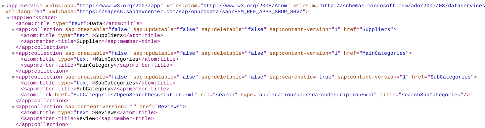
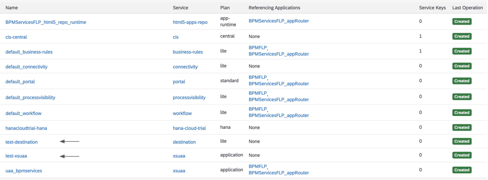
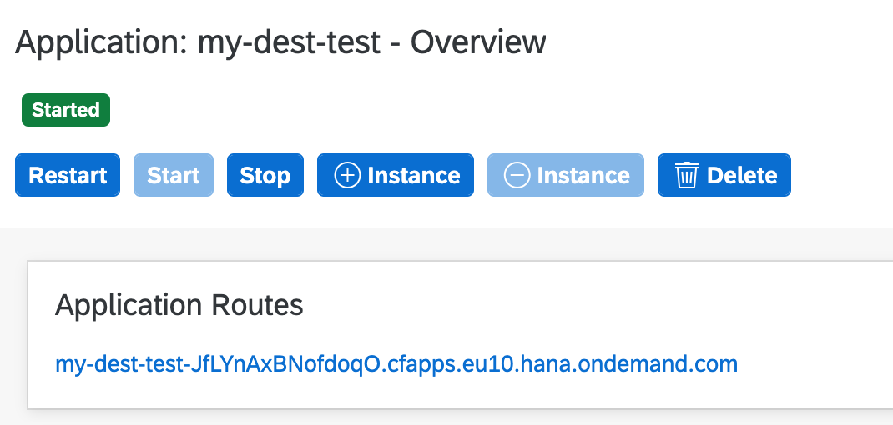

# Exercise 04 - Establishing a destination in SAP Cloud Platform

In this exercise you'll define a destination within the context of the "Connectivity" area of SAP Cloud Platform.

A destination is a collection of parameters that points to a remote service or resource, which might be available on the general Internet or behind a firewall in an on-prem environment. In the latter case an SAP Cloud Connector installed and configured in that on-prem environment enables requests to flow, and that is what we've set up in the previous exercise.

Once a destination is established, it can be used by apps and services related to that subaccount on the SAP Cloud Platform, which has a very capable [reverse proxy](https://en.wikipedia.org/wiki/Reverse_proxy) mechanism at the heart of the Connectivity service.

In this case, for the business scenario upon which this Virtual Event is based, the destination will be to a specific OData service providing information relating to an online shop.

_Note: If you were unable to install Docker (as described in this Virtual Event's [prerequisites](../../prerequisites.md)), you can still continue with this exercise - just follow the special "Without SAP Cloud Connector" instructions where appropriate. You can of course continue with subsequent exercises, as the destination effectively abstracts the actual connection details meaning you can treat it as a logical endpoint after it has been set up._

## Steps

After completing these steps you'll have created a destination pointing to a specific resource in the ES5 system, and tested it out with a very simple app.

### 1. Check the data source

Before creating the destination, which is effectively a pointer to a data source, it's worth checking that data source manually and directly. First, so you can see for yourself what you're aiming to get to from within the SAP Cloud Platform, and second, so you know what you're looking for when you access that data source indirectly (through the destination).

The data source is an OData service in the ES5 system, a system to which you should already have access according to the [services section of the prerequisites for this Virtual Event](../../prerequisites.md#services).

:point_right: Open up the [EPM_REF_APPS_SHOP_SRV](https://sapes5.sapdevcenter.com/sap/opu/odata/sap/EPM_REF_APPS_SHOP_SRV/?sap-client=002) OData service, taking care to specify client 002 in the URL (following the link here will do that for you).

> If you find that you've forgotten your credentials for the ES5 system, you can visit the [ES5 account administration](https://register.sapdevcenter.com/SUPSignForms/?server=sapes5) page to get your password reset.

You should see some XML returned, that looks similar to this:




### 2. Create a new destination definition

:point_right: Go to your "Trial Subaccount Home" page, and select the "Destinations" menu item within the "Connectivity" item.

> You can define destinations at the subaccount level, or at the level of a destination service instance. We'll be defining our destination at the subaccount level in this Virtual Event.

:point_right: Select the "New Destination" option, and in the configuration specify values for the appropriate parameters. Some values will depend on whether you have successfully completed the previous exercise and set up the SAP Cloud Connector or not, so the entire value set is presented twice, covering both scenarios. Use the values for your scenario.

**With SAP Cloud Connector**

If you have an SAP Cloud Connector set up and connected as described in the previous exercise, specify the following properties:

| Property               | Value                   |
| -------------          | ----------------------- |
| Name                   | shopinfo                |
| Type                   | HTTP                    |
| Description            | Virtual Event Shop Info       |
| URL                    | `http://virtuales5:8000/sap/opu/odata/sap/EPM_REF_APPS_SHOP_SRV/` |
| Proxy Type             | OnPremise               |
| Location ID            | (leave blank)           |
| Authentication         | BasicAuthentication     |
| User                   | (your ES5 username)     |
| Password               | (your ES5 password)     |


**Without SAP Cloud Connector**

If you were unable to set up an SAP Cloud Connector in the previous exercise, you should set up the destination to point directly to ES5.

_Note: Remember, we're only "pretending" that the ES5 system is on-prem; it is, in fact, available directly on the public Internet._

| Property               | Value                   |
| -------------          | ----------------------- |
| Name                   | shopinfo                |
| Type                   | HTTP                    |
| Description            | Virtual Event Shop Info |
| Location ID            | (leave blank)           |
| URL                    | `https://sapes5.sapdevcenter.com:443/sap/opu/odata/sap/EPM_REF_APPS_SHOP_SRV/` |
| Proxy Type             | Internet                |
| Authentication         | BasicAuthentication     |
| User                   | (your ES5 username)     |
| Password               | (your ES5 password)     |


**In Both Cases (Important!)**

:point_right: In _both_ cases (whether you have an SAP Cloud Connector or not), add the following property / value pair in the "Additional Properties" section using the "New Property" button, and then save the entire destination definition with the "Save" button:

| Property               | Value                   |
| -------------          | ----------------------- |
| sap-client             | 002                     |


### 3. Deploy a simple app to test the destination connection

At this stage you have the destination definition set up. But will everything work when everything is wired up, including from the workflow definition you'll define later? It's worth testing that new destination with a small app that just routes incoming requests via that destination to the data source (the OData service in ES5) using the Connectivity service.

You will do that in this step, by deploying the simplest app definition (and its corresponding manifest file), and then testing the destination via that app's routing. While you would normally deploy applications from your editor or IDE, you can actually deploy an application archive, along with its corresponding descriptor file (the "manifest") manually from within the SAP Cloud Platform Cockpit.

This simple app is basically the SAP [application router](https://blogs.sap.com/2019/06/13/sap-cloud-platform-backend-service-tutorial-24-understanding-app-router/) with configuration that tells it to route incoming requests to a target that's exposed via the destination that has been setup. For your reference, the entirety of this app and configuration is in the [dest-test-app/](dest-test-app/) directory, as follows:

| File          | Description               |
| ------------- | ------------------------- |
| manifest.yml  | the descriptor file describing how the application is to be deployed, and upon which services it relies |
| package.json  | the Node.js package description for the app, describing essentially what the app relies upon (the `@sap/approuter` package) and how to start it up |
| xs-app.json   | The approuter configuration, in the form of a single route that uses the `shopinfo` destination |
| .npmrc        | Some local Node.js package manager (npm) configuration to define which registry to use for `@sap`-namespaced packages |

The three files `package.json`, `xs-app.json` and `.npmrc` have been bundled together into the archive file `app.zip` (also in the same `dest-test-app` directory). There's also an `xs-security.json` file which describes how the `xsuaa` service should be configured, a service upon which the app relies.

:point_right: Download the [`app.zip`](dest-test-app/app.zip) and [`manifest.yml`](dest-test-app/manifest.yml) files. Download the `xsuaa` service parameter file [`xs-security.json`](dest-test-app/xs-security.json) file too.

In fact, the successful operation of the app relies on not one but three services, which you'll set up manually first, before deploying the app:

- Authorization & Trust Management (`xsuaa`)
- Connectivity (`connectivity`)
- Destination (`destination`)

:point_right: Go to your "CF Dev Space Home" and select the "Service Marketplace" menu item (within the "Services" item). From here you'll be setting up instances of these three services, using the same procedure each time:

1. Select the service from the Service Marketplace
1. From the service's Overview page that appears, select the "Instances" menu item
1. Use the "New Instance" button to create a new instance, and specify details for the steps in the resulting dialog each time, according to the following table

| Service:   | Authorization & Trust Management | Connectivity | Destination |
| ---------- | -------------------------------- | ------------ | ----------- |
| Choose Service Plan | Plan: `application` | Plan `lite` | Plan `lite` |
| Specify Parameters  | Upload the `xs-security.json` file via the "Browse" button | (none) | (none) |
| Assign Application  | (none) | (none) | (none) |
| Confirm             | Instance Name: `test-xsuaa` | Instance Name: `test-connectivity` | Instance Name: `test-destination` |

> It's important that you use the instance names specified here, as they are referenced by name in the app's [`manifest.yml`](dest-test-app/manifest.yml) file.

After doing this, you should have three service instances alongside your already existing workflow related instances; checking the "Service Instances" in your "CF Dev Space Home", you should see something like this:




Now the service instances are in place, it's time to deploy the app itself.

:point_right: Still in your "CF Dev Space Home", select the "Applications" menu item and use the "Deploy Application" button. For the "File Location", browse to and select the `app.zip` archive that you previously downloaded. Ensure that the "Use Manifest" checkbox is selected, then browse to and select the `manifest.yml` file that you also previously downloaded for the "Manifest Location". Then use the "Deploy" button.

In a few moments, your app should be shown in the list as in the green "Started" state.

:point_right: Select its name ("my-dest-test") and select the URL in the "Application Routes" section of the app's "Overview" page; the URL will contain a random string in the first part, to ensure that each of your apps deployed have unique hostnames:



After authenticating with your trial user email address and password, you'll be presented with the resource you saw at the start of this exercise. But this time, you're accessing it through the SAP Cloud Platform, via the Connectivity service and a destination definition, instead of directly. Moreover, if you've set up the Cloud Connector, this access is going through that too. Phewf!


### 4. Explore the Products entityset

You'll be using data from the Products entityset in the OData service you've just exposed, so use this step to explore the data in that entityset, so you're at least a little bit familiar with it.

:point_right: Append `Products` to the end of the existing URL, so it looks like this:

```
https://my-dest-test-<randomstring>.cfapps.<region>.hana.ondemand.com/Products
```

:point_right: Explore the data that is returned - you should see a list of products, with the sort of properties you'd expect from a product database, such as an ID, name, description, information about stock quantity, and so on.

If you prefer looking at JSON rather than XML, append the query parameter `$format=json` to the URL, so that it looks like this:

```
https://my-dest-test-<randomstring>.cfapps.<region>.hana.ondemand.com/Products?$format=json
```

_Note: It's at this point you might want to take advantage of the [recommendations](../../prerequisites.md#recommendations) to install formatters for JSON and XML in Chrome._

Notice that there are products with IDs such as "HT-1001" and "HT-1002" representing computer hardware items such as laptops. We'll be referring to these in subsequent exercises.


## Summary

You've now created a destination for use with the Connectivity service in the SAP Cloud Platform, and have successfully tested it, surfacing information from the remote ES5 system via a simple route mapping definition as part of an approuter-based app.

You're now all set to be able to successfully consume the OData service at the endpoint you've defined in the destination from other services, in particular, the Workflow service.

## Questions

1. When you went to look at the OData service EPM_REF_APPS_SHOP_SRV for the first time at the start of this exercise, what was the resource that was returned?
<!-- the OData's service document -->

2. What causes the random section of the URL to be generated?
<!-- the random-route parameter in the manifest -->

3. What do you think the "Location ID" property is used for? How might we use it here, if we wanted to specify a value?
<!-- for when multiple SCCs are connected to the same subaccount -->
