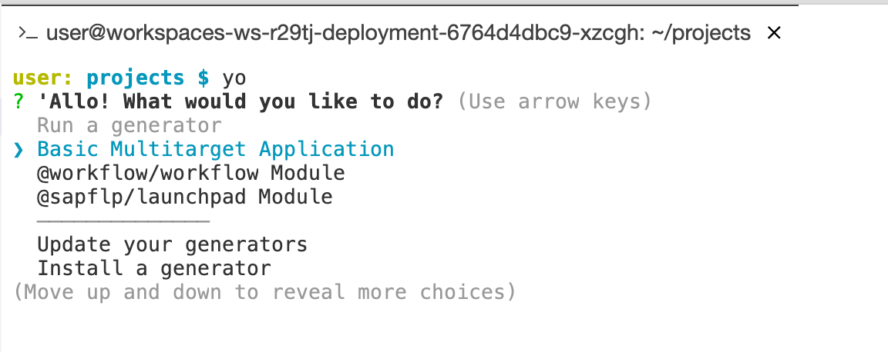
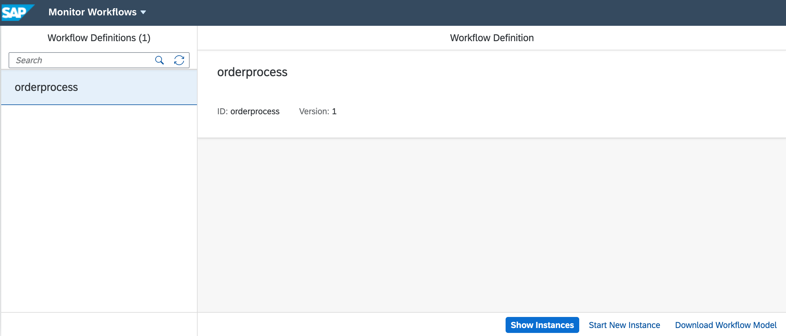

# Exercise 05 - Creating, deploying & instantiating a simple workflow

In this exercise you'll create the simplest workflow definition possible, and deploy it to SAP Cloud Platform, whereupon you'll use the workflow related apps you set up in your Portal service powered Fiori launchpad (FLP) site to create an instance of the definition and look at it.

## Steps

After completing these steps you'll understand the general flow of development, deployment and usage of workflows on SAP Cloud Platform, specifically in the Cloud Foundry (CF) environment.

### 1. Create a new Workflow project

:point_right: Get back to your "App Studio Workflow Dev Space" by means of the same-named bookmark that you created in a previous exercise.

Previously, you created a project by dragging a directory into the Explorer space. This time, you'll use command line tools in the App Space's terminal facility.

:point_right: Open up a terminal using menu path "Terminal -> New Terminal". You should be presented with a command line prompt, most likely showing the current location to be the `projects/` directory.

If you're familiar with Unix shells, you'll feel right at home - don't forget, [#TheFutureIsTerminal](https://twitter.com/search?q=%23TheFutureIsTerminal&src=typed_query)!

One of the command line tools available here and used to generate new projects is [Yeoman](https://yeoman.io). Let's use it now to generate a project within which we'll create a workflow definition. The project that we'll need to create looks conceptually like this:

```
+---------------------------------+
| Multi-target application        |
|                                 |
| +-----------------------------+ |
| | Workflow module             | |
| |                             | |
| | +-------------------------+ | |
| | | Workflow definition     | | |
| | |                         | | |
| | |                         | | |
| | +-------------------------+ | |
| |                             | |
| +-----------------------------+ |
|                                 |
+---------------------------------+
```

In other words, the definition of the workflow itself lives within a module, which is part of a multi-target application (MTA). The build and deployment artifact is the top-level MTA.

:point_right: At the command prompt, enter the command `yo` to invoke Yeoman. You should be presented with a menu similar to this:



:point_right: Choose "**Basic Multitarget Application**" and make this specification:

|Property|Value|
|-|-|
|Project name|OrderFlow|

The Yeoman generator should complete pretty much immediately, and you should see that there's a new project directory `OrderFlow/` visible in the App Studio Explorer.

:point_right: Still within the terminal, move into the new `OrderFlow/` directory with `cd OrderFlow/` and then invoke `yo` again, this time choosing the "**@workflow/workflow Module**", specifying the following:

|Property|Value|
|-|-|
|Module name|OrderProcess|
|Workflow name|orderprocess|
|Workflow description|(leave blank)|

> You may get a message about a conflict with `mta.yaml` - here you can safely enter "y" to have the contents updated.

On completion, you should see a message similar to this:

```
create OrderProcess/workflows/orderprocess.workflow
```

> The names of the project, module and workflow definition are deliberately different here, to highlight that they're not the same thing. Note also, implied by the final message above, that you can have multiple workflow definitions in a single workflow module.

You should end up with a very simple workflow definition, that looks like this:


Observe that the workflow definition editor is graphical, and the file that represents the definition is within a `workflows/` directory within the project.

In the last part of this step, we need to turn our attention to what's been added to the `mta.yaml` file as a result of adding this workflow module.

:point_right: Open the OrderFlow project's `mta.yaml` file it in the editor and take a look - it should look something like this:

```yaml
_schema-version: "3.2"
ID: OrderFlow
version: 0.0.1
modules:
  - name: OrderProcess
    type: com.sap.application.content
    path: OrderProcess
    requires:
      - name: workflow_mta
        parameters:
          content-target: true
resources:
  - name: workflow_mta
    parameters:
      service-plan: standard
      service: workflow
    type: org.cloudfoundry.managed-service

```

Take a moment to [stare](https://langram.org/2019/04/08/es6-reduce-and-pipe/) at this. You can see that there's a single module defined, with the name `OrderProcess`, which requires a Workflow service resource named `workflow_mta`, of type `org.cloudfoundry.managed-service`. The name of this required resource has been simply generated from the word "workflow" suffixed with "mta".

But we already have a Workflow service instance called `default_workflow` which was created by the Workflow Management booster in an earlier exercise, so we need to adapt the references here in the `resources` section of the `mta.yaml` file, to reflect that.

:point_right: First, modify the `type` of the resource defined, changing it from `org.cloudfoundry.managed-service` to `org.cloudfoundry.existing-service`, to reflect the fact that you already have a Workflow service instance.

:point_right: Second, remove both the `service-plan` and `service` parameter properties (these are usually only needed when creating a new service instance), and add a new parameter property `service-name: default_workflow` to point to your existing Workflow service instance.

The result should look like this:

```yaml
_schema-version: "3.2"
ID: OrderFlow
version: 0.0.1
modules:
  - name: OrderProcess
    type: com.sap.application.content
    path: OrderProcess
    requires:
      - name: workflow_mta
        parameters:
          content-target: true
resources:
  - name: workflow_mta
    parameters:
      service-name: default_workflow
    type: org.cloudfoundry.existing-service
```

Don't forget to save your changes!


### 2. Build and deploy the project to the cloud

While this workflow definition doesn't do very much, we can still carry out an initial exploration with the apps we made available in the Fiori launchpad in [Exercise 02](../02). So in this step we'll build and deploy the workflow definition to SAP Cloud Platform to be able to do that.

:point_right: Use the context menu on the `mta.yaml` file in the App Studio Explorer (make sure it's the one in the `OrderFlow/` project directory) and choose "Build MTA".

> If you prefer, you can stay in the terminal and build the MTA there by invoking `mbt build`.

The build process thus triggered should complete in a few moments, and create a new directory `mta_archives/` within the project structure, containing an `.mtar` archive file ready to be deployed.

:point_right: Deploy that file (it will most likely be called `OrderFlow_0.0.1.mtar`) using the context menu on the file name and choosing "Deploy MTA Archive", like this:


> Again, if you prefer, you can stay in the terminal and deploy it from there, by invoking `cf deploy mta_archives/OrderFlow_0.0.1.mtar` (assuming here that you're still in the `OrderFlow/` directory).

This deployment should also complete quite quickly. If you examine the contents of the `mta.yaml` file that you just edited, and also check the Applications and Service Instances sections of your "CF Dev Space Home" in the SAP Cloud Platform Cockpit, you'll see that this was a content deployment, rather than instantiation of any new CF service instances or applications. This makes sense, as it's a deployment of the workflow definition to the Workflow service instance.


### 3. Examine the workflow definition and create an instance of it

:point_right: Go to your Fiori launchpad site and start the "Monitor Workflows - Workflow Definitions" app. You should see something like this:



You can see that this is version 1 of the definition, the first version you've deployed (the version number is incremented automatically on each new deploy).

Here you can start a new instance, which is what you should do now. Built in to the system is some simple test data that can be used to populate new instances of workflow definitions for testing purposes. You can, if you wish, modify or completely overwrite the test data.

:point_right: Use the "Start New Instance" button, and in the dialog that appears, leave the test data as it is, and continue with the "Start New Instance" button to have an instance of your workflow definition created. A message should appear briefly to confirm that.

### 4. Look at the workflow instance

:point_right: Switch to looking at the workflow instance you created, by using the "Show Instances" button.

You should see a filtered display in the master list ... but it's likely that you won't see your newly created instance. This is because the default filter is to show instances with the following status values:

- Erroneous
- Running
- Suspended

Because of the simplicity of your workflow definition right now, the instance has already completed.

:point_right: Use the filter icon at the bottom of the master list to add the status "Completed" to the status values.

You should now see your instance. There's plenty of information to examine.

:point_right: Take a couple of minutes to explore the information.

### 5. Create another workflow instance with different data

Before finishing this exercise, it's worth going through the process of manually creating a workflow instance again, this time supplying different data.

:point_right: Navigate back to the display of the workflow definition, and use the "Start New Instance" button again. This time, replace the entire test data (relating to the Hamlet book) with the following (which relates to product IDs in the OData service mentioned in the [Services section of the prerequisites](../../prerequisites.md#services)):

```json
{
  "request": {
    "Id": "HT-1001",
    "Quantity": 5
  }
}
```

Examining the completed instance this time, you should see this data in the Workflow Context section.

## Summary

You've now gone through the process of bringing a workflow definition from your development environment (the SAP Business Application Studio) to the Workflow service on the SAP Cloud Platform, and using the administration apps to create and examine instances of it. You'll find that the "Monitor Workflows" app is a very useful tool.

## Questions

1. There are two tiles to look at workflow information - definitions and instances. Are there actually two apps? How did you jump from looking at your definition to looking at instances of it? What changed in the URL when you jumped?

1. What sort of information did you find when examining the completed workflow instance? Did you understand what everything was? What was in the workflow context, and what did you see when you selected "Show Tasks"?
