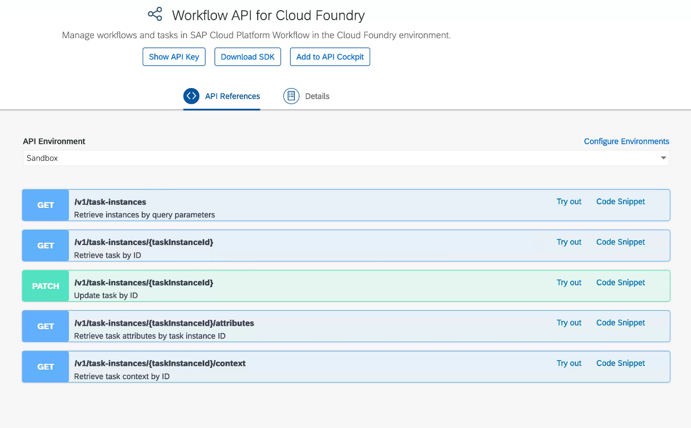
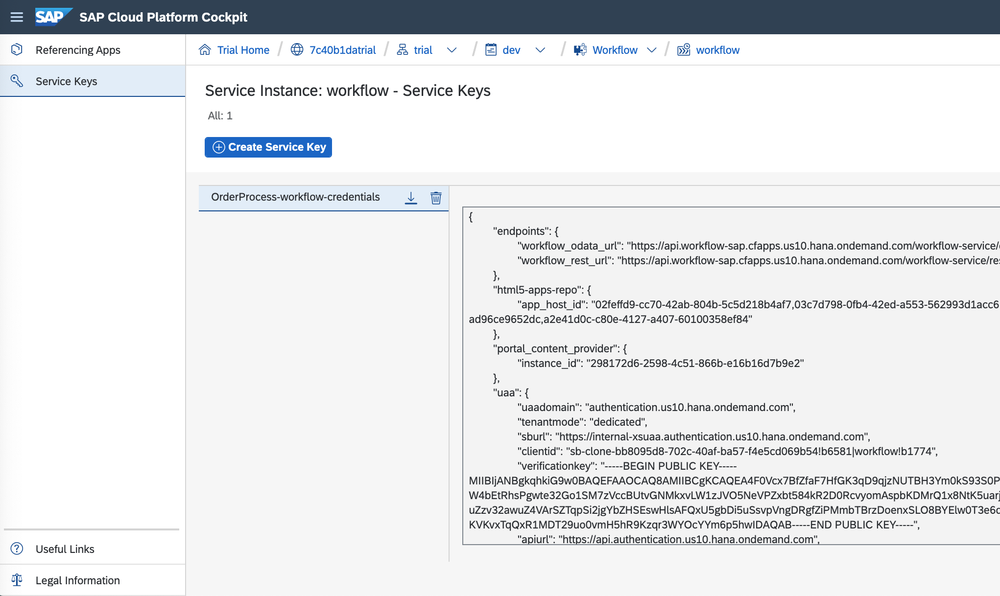
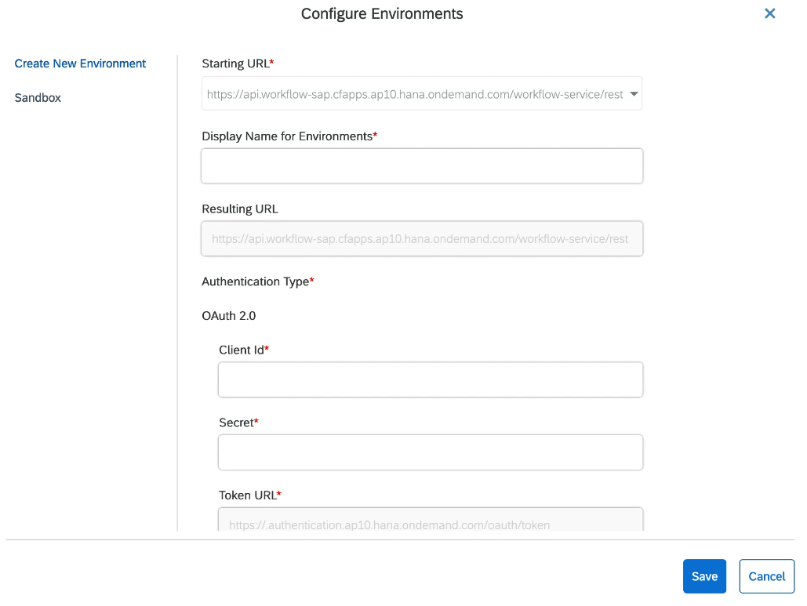
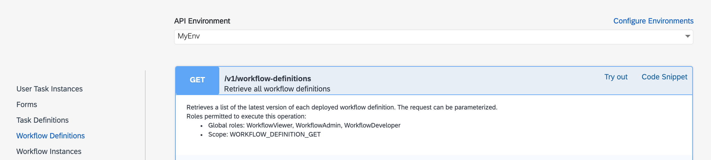
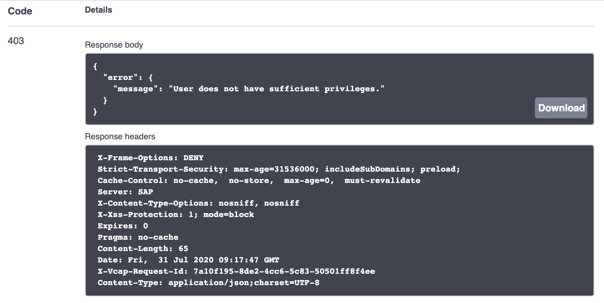
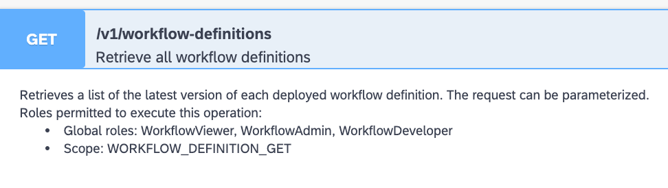
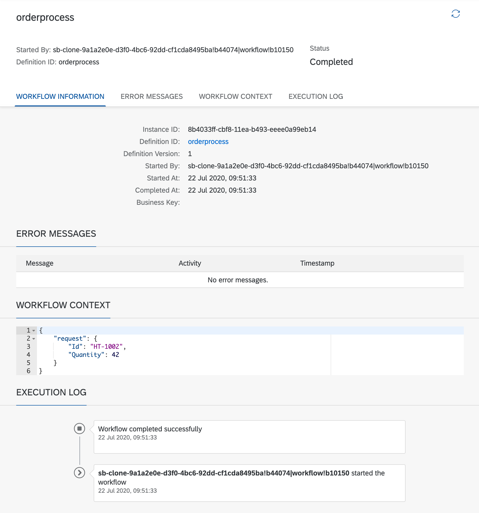

# Exercise 06 - Exploring the API Hub and the Workflow API

In this exercise you'll take a look at the details of the Workflow service API in the SAP API Business Hub, and use the API to create an instance of your `orderprocess` definition, instead of doing it via the "Monitor Workflows" app.

## Steps

After completing these steps you'll have set up an environment in the SAP API Business Hub that reflects the details of your trial account, and tried out a couple of API calls to start off a workflow via the API.

### 1. Log on to SAP API Business Hub

:point_right: Go to the [SAP API Business Hub](https://api.sap.com/) and log on.

This is the central place for discovery and consumption of APIs - see it as your "one stop shop" to learn about and try out APIs in the SAP universe. Take a few moments to look around and familiarize yourself with the site.

### 2. Find the Workflow API

The Workflow API is of course documented and available for exploration here in the API Hub.

:point_right: [Search for](https://api.sap.com/search?searchterm=workflow+API&tab=all) the Workflow API - you should find a number of results. The one we're interested in here is the [Workflow API for Cloud Foundry](https://api.sap.com/api/SAP_CP_Workflow_CF/resource). You should see something like this:



It describes the different aspects that the API covers, such as:

- User Task Instances
- Workflow Definitions
- Workflow Instances
- Forms

and so on.

For each aspect there are a number of verb / noun combinations, in the form of HTTP methods (representing the verbs /  and URL paths (representing the nouns). This verb / noun approach suggests that the Workflow API exhibits some qualities of the Representational State Transfer (REST) architectural style.

:point_right: Explore each of the aspects, in particular "Workflow Instances". Try to identify which verb / noun combination in the "Workflow Instances" aspect would be appropriate to create a new instance of a workflow definition.


### 3. Configure an API Environment

In the API Hub you can not only explore but also try out APIs. For this, there's a generic sandbox environment provided, but it's better and more convenient to set up an API environment that reflects your Cloud Foundry (CF) trial account setup. In this step you'll do just that, defining an API environment using credentials relating to the workflow service instance you've set up there.

When you configure an environment, you need to supply endpoint and credential information, so the API Hub can facilitate making API calls for you. This information is available in the details of your workflow service instance, so you'll go there first to get that information, then return to the API Hub to specify it during the configuration.

:point_right: Open up a new browser tab and go to your "Dev Space Home". Find the workflow service instance (use the "Service Instances" within "Services" in the left hand navigation) and select it, remembering that its name is `default_workflow`.

:point_right: Now select the "Service Keys" navigation item which will reveal that there's a service key "OrderProcess-workflow_mta-credentials" that's been created for you. It should look something like this:



:point_right: Make a note of the following properties, the names of which reflect their "full paths" within the JSON structure:

- `endpoints.workflow_rest_url`
- `uaa.clientid`
- `uaa.clientsecret`
- `uaa.url`

:point_right: Now switch back to the API Hub tab and select the "Configure Environments" link to get to a dialog where you can create a new environment. You should see something like this:



You should be defaulted to the "Create New Environment" mode.

:point_right: Specify the following values, noting that the Starting URL selection should reflect the value of the `endpoints.workflow_rest_url` property, including the particular region:

| Property       | Value                   |
| -------------- | ----------------------- |
| Starting URL   | the value of `endpoints.workflow_rest_url` |
| Display Name for Environments | MyEnv |
| OAuth 2.0 Client Id | the value of `uaa.clientid` |
| OAuth 2.0 Secret    | the value of `uaa.clientsecret` |
| consumersubdomain   | the most significant hostname part of the fully qualified domain name value of `uaa.url` |
| landscapehost    | the rest of the fully qualified domain name value of `uaa.url`, excluding the 'authentication' part |
| Apply this environment to all APIs in this package that are not yet configured | _checked_ |
| Save this environment for future sessions | _selected_ |

Regarding the values for the properties "consumersubdomain" and "landscapehost", these are parts that contribute towards the generated value for "Token URL". Here's an example:

- the value of `uaa.url` is `https://898789e9.authentication.eu10.hana.ondemand.com`
- the value of "consumersubdomain" should be `898789e9trial`
- the value of "landscapehost" should be `eu10.hana.ondemand.com`
- the resulting "Token URL" should be `https://898789e9trial.authentication.eu10.hana.ondemand.com/oauth/token`

Don't forget to save the settings when you're done.

### 4. Attempt to request workflow definition information via the API

Now you can try out your new API environment by requesting information on the workflow definitions that you've already deployed to the Workflow service. If this is your first experience with the Workflow service, you should just see the single `orderprocess` definition in the results.

:point_right: Select the "Workflow Definitions" aspect, and identify the verb / noun combination:

```
GET /v1/workflow-definitions
```

:point_right: Select your new API environment in the dropdown selection at the top of the verb / noun list, so that the "MyEnv" environment is shown as selected.



:point_right: Use the "Try out" link to expand and explore the API call. You can leave all the parameters as they are, and use the "Execute" button to make the API call.

An API call is made for you, with your credentials, in the context of the environment that you defined. The results are shown, including the HTTP status code, the body of the response, and the response headers:



Wait, what?

This is not what we were expecting, or at least not what we want. The HTTP status code is [403](https://en.wikipedia.org/wiki/HTTP_403), conveying the message that access to the requested resource (the `/v1/workflow-definitions` resource) is forbidden. Why is that?

For many services, API usage is protected by scopes, also known as authorities. These scopes are relevant when using an authenticated connection in the context of an OData 2.0 client credentials grant type. In other words, authorities come into play (to "authorize" a call) when the authentication is connected directly to the instance. When an instance of a service is created, there may be some default scopes included, but it's always best to be explicit and specify the scopes that you'll require.

If an instance is created as part of a larger process, like in the booster case in an earlier exercise, you can update the service instance and add the scopes manually.

That's what we're going to do now.


### 5. Add the required scopes to the workflow service instance

Updating a service instance can be done from the command line, using the `cf` command. You can use the terminal in your App Studio Workflow Dev Space.

:point_right: Open up your App Studio Workflow Dev Space and get to a terminal prompt. You may have to use the menu path "Terminal -> New Terminal".

:point_right: Depending on how long it's been since you last used the `cf` command in this virtual event, you may have to log in again. Check by issuing the `cf target` command, where you'll either get a message indicating you need to log in again, or you'll get some output showing you what endpoint you're connected to, including what organization and space.

While we know that the name of the instance we want to update is `default_workflow`, it's good practice to double check.

:point_right: List the instances with `cf s`; you should see some output that looks like this (vertically truncated for readability):

```
name                                service             plan
BPMServicesFLP_html5_repo_runtime   html5-apps-repo     app-runtime
default_business-rules              business-rules      lite
default_connectivity                connectivity        lite
default_portal                      portal              standard
default_processvisibility           processvisibility   lite
default_workflow                    workflow            lite
test-destination                    destination         lite
test-xsuaa                          xsuaa               application
uaa_bpmservices                     xsuaa               application
```

There it is, `default_workflow`, an instance of the `workflow` service using the `lite` plan.

It's almost time to update the instance with the scopes we need. First, though, how do we know what they are? Looking closely back at the API endpoint information in the API Hub, we'll see what we're looking for.

:point_right: Switch back to the API Hub and look at the details directly below the `GET /v1/workflow-definitions` API endpoint. They should look something like this:



Relevant here is the line:

```
Scope: WORKFLOW_DEFINITION_GET
```

This is the scope that's needed to authorize a call to this endpoint. We're going to call another endpoint later in this exercise, so let's find out now what the scope required for that is, so we can add them both in the same instance update.

:point_right: Select the "Workflow Instances" group on the left hand side and find `POST /v1/workflow-instances` in the HTTP verb / noun combinations. Expand it to reveal the details, which should look (in context) like this:


In this case, the scope required to make such a call is shown as follows:

```
Scope: WORKFLOW_INSTANCE_START
```

Now we have the information we need to update the workflow service instance.

In the terminal in your App Studio, use this to specify these two scopes for the `default_workflow` instance:

```shell
cf update-service default_workflow -c '{"authorities": ["WORKFLOW_DEFINITION_GET", "WORKFLOW_INSTANCE_START"]}'
```

> The value supplied with the `-c` command option is in JSON format, make sure you use the right combination of quotes and brackets. Happily, as we're all using a Linux based Bash shell there are no variations to worry about here!

This update should complete with a simple "OK" message.

If you want to confirm this, you can use the `cf curl` feature to request the retrieval of instance parameters, like this:

```
user: projects $ cf curl /v2/service_instances/$(cf service default_workflow --guid)/parameters
{
   "authorities": [
      "WORKFLOW_DEFINITION_GET",
      "WORKFLOW_INSTANCE_START"
   ]
}
```

You can refer to the [Cloud Foundry Reference Guide for curl](https://cli.cloudfoundry.org/en-US/cf/curl.html) for more information.


### 6. Make another request for the workflow definition information

Back in the API Hub you can now re-attempt the request you tried earlier in this exercise.

:point_right: Find the `GET /v1/workflow-definitions` endpoint, make sure your environment "MyEnv" is selected, and use the "Try out" feature again.

This time, the API call should complete successfully, you should receive an HTTP status code of 200, and a response body that looks like this:

```json
[
  {
    "id": "orderprocess",
    "version": "1",
    "name": "orderprocess",
    "createdBy": "sb-clone-60821b99-4ce8-43e9-a326-ce3a0fbad708!b51083|workflow!b10150",
    "createdAt": "2020-07-27T05:56:57.256Z",
    "jobs": []
  }
]
```

Take a moment to stare at this output to understand it. And feel happy - you've just made your first successful API call, well done!


### 7. Create a new workflow instance via the API

Now that you've tried out a read-only API call, it's time to use the API to create a new instance of your `orderprocess` workflow definition.

:point_right: Select the "Workflow Instances" aspect and thence the `POST /v1/workflow-instances` verb / noun combination. Select the "Try out" link to be able to set up and execute the call.

A payload is sent with this call, and you specify it in the "body" parameter here.

:point_right: Specify the following for the value of the "body" parameter, being careful to get it exactly right, as it's JSON -- and quotes, colons and curly braces matter:

```json
{
  "definitionId": "orderprocess",
  "context": {
    "request": {
      "Id": "HT-1002",
      "Quantity": 42
    }
  }
}
```

_Note: It should be fairly evident what this is - it's the payload that is to be supplied to the workflow instance (very much like what we specified in the previous exercise), along with the workflow definition identifier._

:point_right: Use the "Execute" button to send the request.

You should see a response with an HTTP status code of 201, and a response body & response headers that look like this:

**Response body**

```json
{
  "id": "b2b8f958-cbfe-11ea-a160-eeee0a8df42a",
  "definitionId": "orderprocess",
  "definitionVersion": "1",
  "subject": "orderprocess",
  "status": "RUNNING",
  "businessKey": "",
  "startedAt": "2020-07-22T09:35:36.882Z",
  "startedBy": "sb-clone-9a1a2e0e-d3f0-4bc6-92dd-cf1cda8495ba!b44074|workflow!b10150",
  "completedAt": null
}
```

This call was possible because you included the WORKFLOW_INSTANCE_START scope in the instance update earlier. Great!


### 8. Check the newly created instance in the Fiori launchpad

It is of course possible to use the "Workflow Monitor - Workflow Instances" to view this newly created instance. You can do that in this step.

:point_right: Open up the "Workflow Monitor - Workflow Instances" app in your Fiori launchpad site. Don't forget to ensure that the filter is still allowing the display of instances in the "Completed" state.

_Note: By the time you open the app, the instance will have completed, but it's nice to see the status immediately after creation, which was shown in the response body to the `POST /v1/workflow-instances` request. This status, as you can see above, was "RUNNING"._

:point_right: Examine the details for the instance, and try to match values up with what you saw from the results of the API call. You should be able to see that the values for the "Instance ID" and "Started At" properties, for example, are the same.

_Note: Timezones play a part in dates and times, so the hour values may be offset - the time given in the API output is in UTC._

Here's an example of what you might see:




## Summary

You've explored the Workflow API in the API Hub and successfully started a workflow instance via that API, supplying data that finds its way into the context of that instance. You've also managed to find evidence of that instance in the administration UI. Nice work!

## Questions

1. Why are there square brackets surrounding the response to the `GET /v1/workflow-definitions` API call?

1. In the payload of the `POST` call to `/v1/workflow-instances`, can you explain all aspects of the data contained therein?

1. What does HTTP response code 201 signify and how does it differ from 200?

1. Did you notice anything interesting about the instance created via the API, when compared to the ones you created via the Fiori monitor app?
