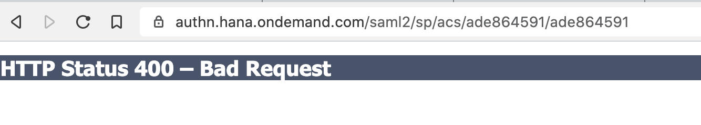
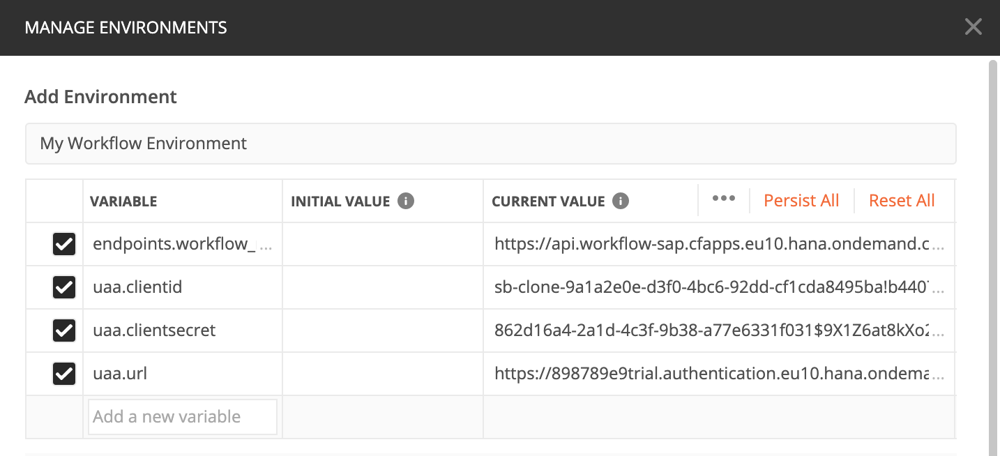
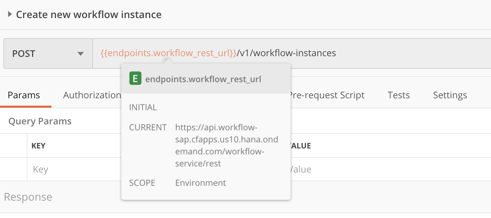
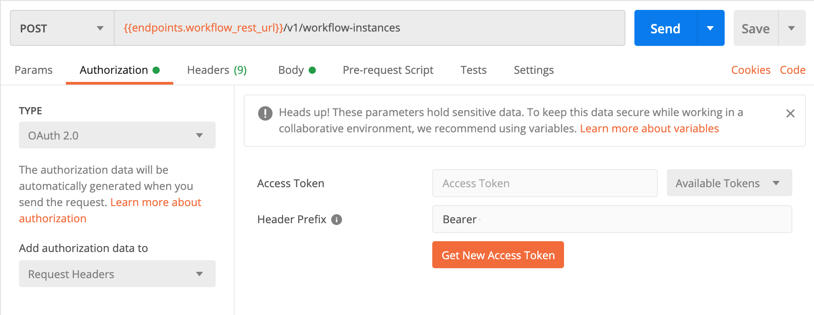
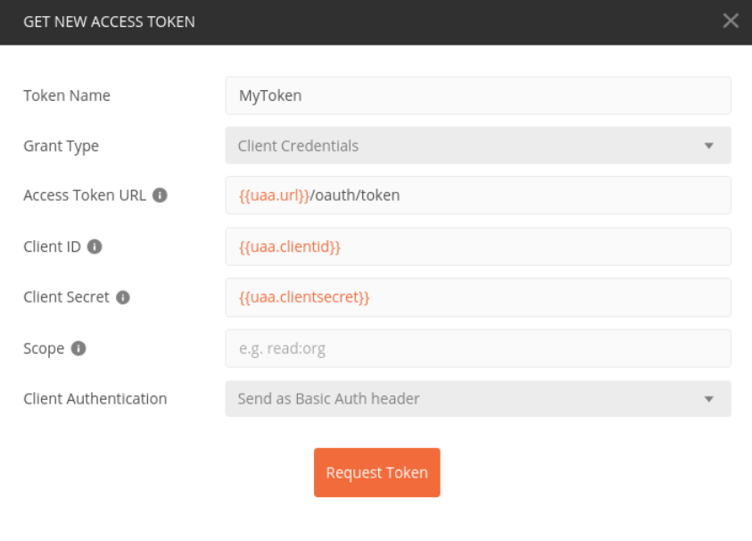
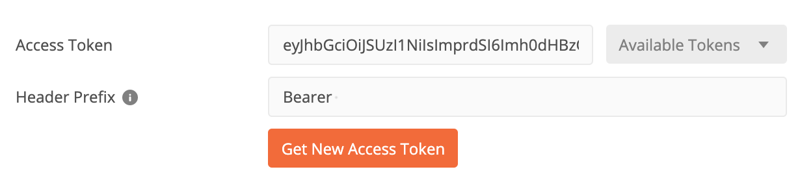
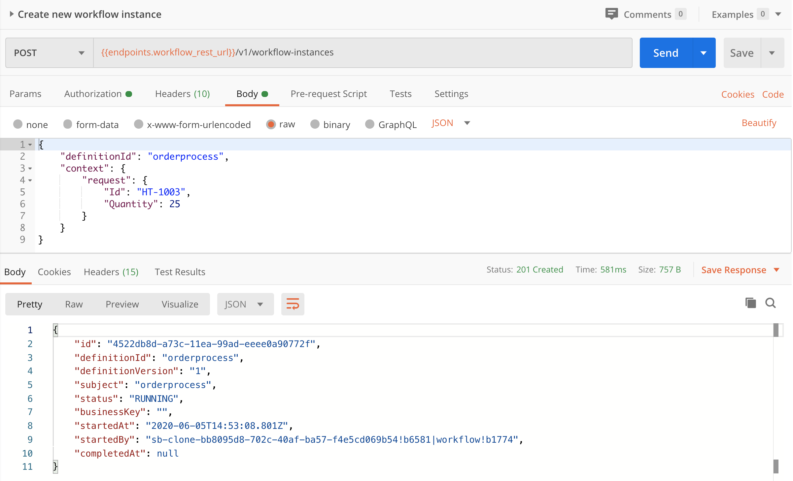

# Exercise 07 - Calling the Workflow API from Postman

In the previous exercise you used the SAP API Business Hub to explore and use the Workflow API. With the confidence gained in those steps, it's now time to make similar calls, to create a new workflow instance, from a 3rd party API client - Postman.

Postman is a very capable HTTP client with many features. In this exercise you'll use some of them, specifically environments and variables, and make use of the built-in support for OAuth 2.0.

Using these features, you can achieve a semi-automated mechanism for creating new instances of your "orderprocess" workflow definition.

## Steps

After completing these steps you'll know how to instantiate new workflows from Postman (and, by inference, from other API clients and tools). You'll also have a closer feel to what's going on behind the scenes in the SAP API Business Hub with respect to authentication.


### 1. Open Postman and import the Workflow Collection

The API call you made in a previous exercise has been encapsulated into a small Postman collection that you can import and use.

:point_right: Launch Postman and get ready to import a collection using the "Import From Link" feature in this dialog box that you get when you select the "Import" button at the top left of the Postman UI:


:point_right: In the dialog, specify the URL to this [workflowcollection.json](https://raw.githubusercontent.com/qmacro/cloud-platform-workflow-virtual-pilot/master/exercises/07/workflowcollection.json) resource, and use the "Import" button to complete the process.

### 2. Create a new Postman environment

Postman offers the facility to manage collections of settings that pertain to different contexts, for example you might have a couple of development contexts and system endpoints, and a production context. These are called "environments" in Postman and in this step you will create one to store the details of your specific SAP Cloud Platform trial account context.

Within environments you can use variables, and the environment-specific values for these are substituted at runtime.

Environments are also separate by design from requests and collections, so that you can share the latter without compromising security by sharing values in the former.

:point_right: Examine how these variables are used, by expanding the hierarchy of the "Workflow Collection" to reveal and select the POST request "Create new workflow instance", and looking at how the URL of that request is defined.

You should see something like this:



:point_right: Notice the use of the `{{endpoints.workflow_rest_url}}` variable in the URL, and the fact also that currently, indicated in the top right of the Postman UI, there is "No Environment" set.

So at this point the request in its skeleton form is ready but you need to supply a value for the root of the URL, and also Postman needs to know how -- or more specifically with what credentials -- to request an OAuth token. It's a good idea to configure this in an environment, which is sort of the equivalent of the API Hub environment you configured in the previous exercise.

:point_right: First, use the "Manage Environments" button (the cog) in the top right to open up a dialog where you can add an environment. In the form that appears, specify "My Workflow Environment" for the name.

:point_right: Next, add each of the four properties from the service key data we came across in the previous exercise, as variables in this new environment:

- `endpoints.workflow_rest_url`
- `uaa.clientid`
- `uaa.clientsecret`
- `uaa.url`

You should end up with something like this:



> The property names in Postman environments are arbitrary, but it makes sense to use names that mean something to us.


### 3. Select the new environment for use

Once you've finished adding this new environment, you should select it for use.

:point_right: Select the new environment from the drop-down selection that you saw earlier (it was set to "No Environment" at that time). Then notice that the `{{endpoints.workflow_rest_url}}` variable in the request URL has turned from red, indicating the variable wasn't defined, to a slightly more orange color, and when you hover over it the value is displayed:




### 4. Set up authentication for the request

The Cloud Foundry (CF) Workflow APIs are protected with OAuth 2.0, and the API Hub handles that for us, specifically using the "Client Credentials" flow. In order to make the call in Postman, we need to take the variable values we specified in our environment and use them in Postman's OAuth 2.0 configuration for retrieving an access token, which is what's requested and used in such a flow.

:point_right: Switch to the "Authorization" tab of the request and, for the type, select "OAuth 2.0". This should give you the possibility of setting things up for requesting and using OAuth 2.0 access tokens as employed in the OAuth flow we want to use:



:point_right: Now use the "Get New Access Token" button to specify details for, and request, an access token. In the dialog box that appears, give a name such as "MyToken", select "Client Credentials" for the grant type, "Send as Basic Auth header" for the client authentication, and specify the values for "Access Token URL", "Client ID" and "Client Secret" using the environment variables you defined earlier. Make sure to add `/oauth/token` as a suffix to the access token URL:



:point_right: Use the "Request Token" button which will make the OAuth 2.0 call to request an access token, which, if all goes well, will be shown to you and subsequently be available via the "MyToken" name you gave it.

> If you're curious to see what actually happened in this request, you can use Postman's console (View -> Show Postman Console) to inspect the HTTP traffic for this access token request call.

:point_right: Back in the Authorization tab, now select the token using the "Available Tokens" selection, so that the "Access Token" parameter is filled in, something like this:




### 5. Examine the rest of the request's details

In this step you'll take a final look at the request before submitting it.

:point_right: While still in the Authorization tab, use the "Preview Request" button to update the request details with the authorization data (you don't have to do this, it will be generated automatically when you send the request, this is just a way of seeing it before the request is submitted).

:point_right: Notice that when you do this, the number of headers shown in the Headers tab goes up by one. Switch to that tab now, and look at the Temporary Headers, where you should see an Authorization header with the access token as the value, preceded with the word "Bearer". This is Postman using the access token (that you retrieved just before) to authenticate the actual API call.

:point_right: Now look at the "Body" tab and you should see something that looks familiar - a request body similar to the one you specified in Exercise 06 when you [created a new workflow instance](../06/readme.md#5-create-a-new-workflow-instance-via-the-api):

```json
{
  "definitionId" : "orderprocess",
  "context": {
    "request": {
      "Id": "HT-1003",
      "Quantity": 25
    }
  }
}
```

### 6. Make the request

Now it's finally time to send the request to create a new workflow instance.

:point_right: Send the request with the "Send" button and examine the response.

If all goes well, you should see something in the response body - similar to what you saw in the response body in the previous exercise when you created a new workflow instance. Note too that the HTTP status code is, as expected, 201.



Great! This is only a very short step, but an important one - it shows that you've set everything up correctly to authenticate with OAuth "Client Credentials" flow.


### 7. Check the new instance in the Fiori launchpad

As a final step in this exercise, you should check the newly created instance in your Fiori launchpad.

:point_right: Open up your Fiori launchpad and select the "Monitor Workflows - Workflow Instances" app. Make sure that the filter in the master list includes the status "Completed". You should see the instance you have created via Postman - you can identify it by the fact that product with ID "HT-1003" (rather than "HT-1002" or "HT-1001") has been requested.

Nice work!

## Summary

You've now got a Postman environment set up, with a simple request that can be conveniently run to create new workflow instances. Moreover, you have a better feel for how these requests are authenticated.

## Questions

1. What's the difference between the "Initial Value" and "Current Value" columns in environment variable definitions?

1. What other HTTP client tools might you have in mind to use instead of (or in addition to) Postman?

1. How often do you think you'll need to fetch a new access token?
