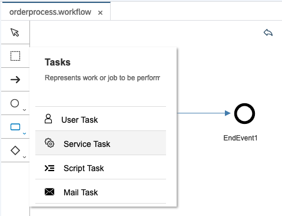
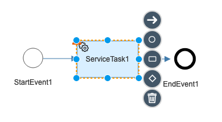

# Exercise 08 - Adding a Service Task to the workflow definition

In this exercise you'll go back to the workflow definition you created in a previous exercise and add a Service Task to it to retrieve product information for the product ID specified when workflow instances are created.

## Steps

After completing these steps you'll have a workflow definition with a service task configured, and have deployed and tested it.

### 1. Open up the workflow definition in the SAP Web IDE Full-Stack

:point_right: Open up the SAP Web IDE Full-Stack that you enabled in [Exercise 01](../01) and used in [Exercise 05](../05). Once the IDE has started up, open the `orderprocess.workflow` workflow definition that should currently sport only a start event and an end event.

### 2. Add a Service Task

:point_right: Use the Tasks menu in the graphical workflow editor to add a Service Task, and place it between the start event and the end event.



It should look like this once you've added it:



You may notice a warning triangle decorating the Service Task in your workflow - this signifies that there is some configuration still needed.

:point_right: While the Service Task is selected, go to the "Details" tab of the "Service Task Properties" on the right hand side, and specify the following values:

| Property              | Value              |
| --------------        | ------------------ |
| Destination           | `shopinfo`         |
| Choose a Service from | (leave as "Others") |
| Path                  | `Products('${context.request.Id}')?sap-client=002` |
| HTTP Method           | GET                |
| Response Variable     | `${context.productInfo}` |
| Principal Propagation | (leave unchecked)  |

> The "shopinfo" value is the name of the destination you created in [Exercise 04](../04).

> The "sap-client=002" query parameter is needed here in the "Path" despite the additional property setting in the destination definition as currently the Workflow service does not support that property.

:point_right: Save the changes.


### 3. Deploy the workflow definition

Now it's time to redeploy to the Workflow service, so that this addition of a Service Task is live. This is done following the same build-deploy procedure you've used already, in [Exercise 05](../05).

:point_right: Use the context menu on the "OrderFlow" project and choose "Build -> Build with Cloud MTA Tool (recommended)". Use the console to follow the build progress through to completion.

:point_right: Now use the context menu on the updated `OrderFlow_0.0.1.mtar` file within the `mta_archives/` directory of the project, and choose "Deploy -> Deploy to SAP Cloud Platform". You can also follow the progress of this step in the console, and it should complete in a relatively short amount of time.

> If you're curious to see some sort of acknowledgement that something has been updated, you can switch to the "Monitor Workflow - Workflow Definitions" Fiori app on your Fiori launchpad, and check that the version number for your "orderprocess" workflow definition has been incremented.


### 4. Create a new instance of the workflow definition

Now we have the Service Task in the workflow definition, let's try it out.

:point_right: Switch back over to Postman and send another "Creat new workflow instance" request (with the blue "Send" button). This should result in another successful 201 status code, showing the details of the freshly minted workflow instance.

:point_right: Now start the "Monitor Workflows - Workflow Instances" app in your Fiori launchpad site, ensuring that the filter is set to show instances in "Completed" status. Find the instance that's just been created, and examine the Workflow Context, which should look something like this:

```json
{
  "request": {
    "Id": "HT-1003",
    "Quantity": 25
  },
  "productInfo": {
    "d": {
      "__metadata": {
        "id": "https://virtuales5:8000/sap/opu/odata/sap/EPM_REF_APPS_SHOP_SRV/Products('HT-1003')",
        "uri": "https://virtuales5:8000/sap/opu/odata/sap/EPM_REF_APPS_SHOP_SRV/Products('HT-1003')",
        "type": "EPM_REF_APPS_SHOP.Product"
      },
      "AverageRating": "3.11",
      "Name": "Notebook Basic 19",
      "StockQuantity": 150,
      "CurrencyCode": "USD",
      "Id": "HT-1003",
      "ImageUrl": "/sap/public/bc/NWDEMO_MODEL/IMAGES/HT-1003.jpg",
      "Price": "1650.00",
      "QuantityUnit": "EA",
      "RatingCount": 9,
      "SubCategoryId": "Notebooks",
      "SubCategoryName": "Notebooks",
      "SupplierId": "100000003"
    }
  }
}
```

> Some of the properties have been omitted to keep the display concise.

Notice that the context now contains extra data, in the `productInfo` property. This is what was retrieved in the Service Task.

## Summary

You now have a workflow definition that includes a task that fetches data from a remote service, in particular, the service available in the on-prem ABAP stack SAP system that you made available via the SAP Cloud Connector.

## Questions

1. When you switched from HTTP Method POST to GET when setting the Service Task properties, the "Path to XSRF Token" property disappeared. Why was that?

1. How does the product data from the OData service end up where it does in the workflow instance context?

1. When we request an entity from an OData service in the browser, such as the [Chai product from the Northwind dataset](https://services.odata.org/V3/Northwind/Northwind.svc/Products(1)), we usually see it in an XML representation, and have to add a query parameter `$format=json` to the URL, like this: [https://services.odata.org/V3/Northwind/Northwind.svc/Products(1)?$format=json](https://services.odata.org/V3/Northwind/Northwind.svc/Products(1)?$format=json). Why do you think we received a JSON representation even when we didn't use this query parameter in the Service Task settings?
