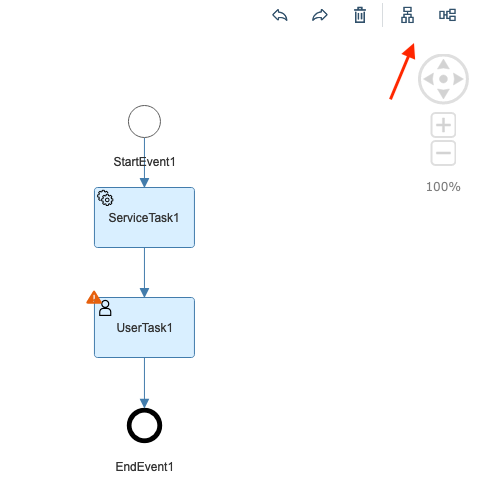
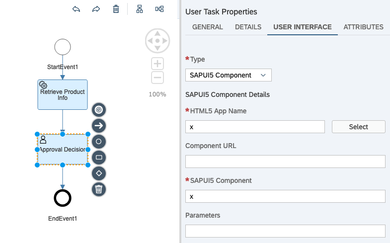
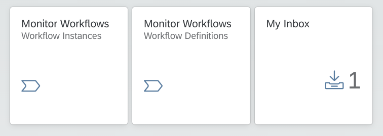
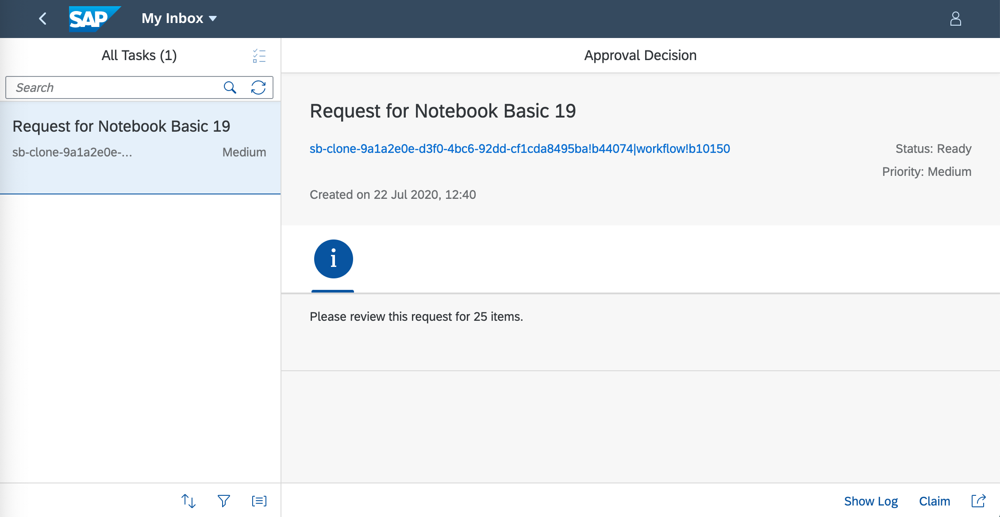
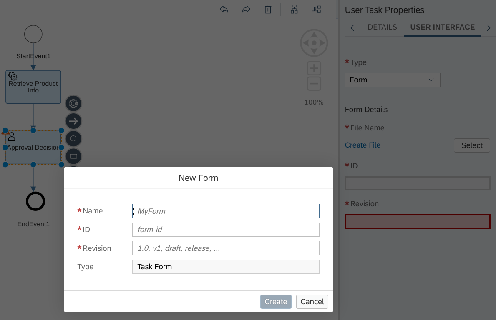
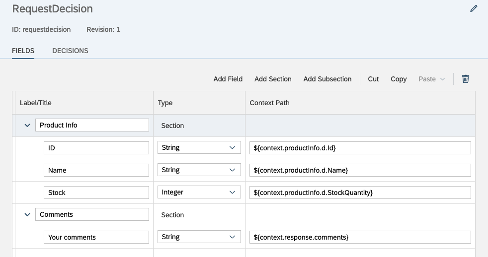
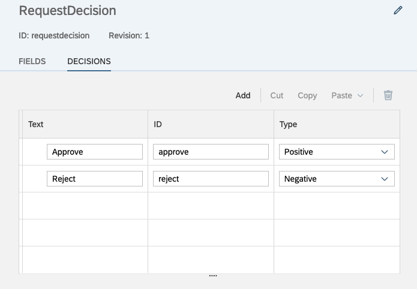
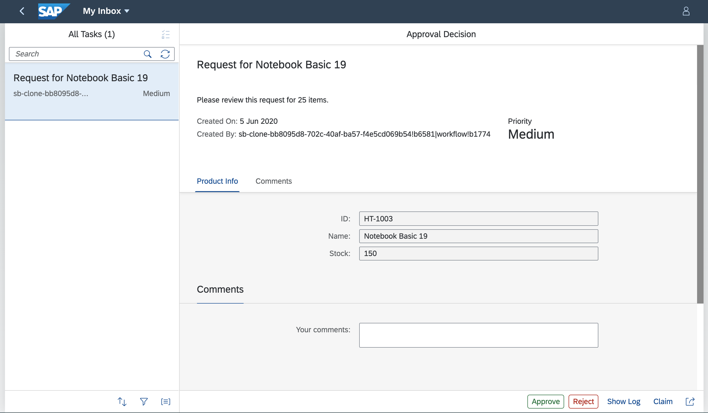

# Exercise 09 - Adding a User Task to the workflow definition

In this exercise you'll enhance the workflow definition by adding a User Task to it, so that a decision point can be presented to a person in the My Inbox app.

## Steps

After completing these steps you'll have a User Task in your workflow definition that presents information from the workflow instance context, and asks for a decision.

### 1. Open up the workflow definition

:point_right: Switch back to your App Studio Workflow Dev Space session, and open the `orderprocess.workflow` workflow definition that should show your definition with the Service Task between the start and end events.

### 2. Add a User Task to the definition

:point_right: In a similar way to how you added a Service Task in [the previous exercise](../08/),  use the Tasks menu in the graphical workflow editor to add a User Task, and place it after the Service Task, and before the end event.

> You can make use of the "Arrange Vertically" and "Arrange Horizontally" buttons in the editor to tidy up the graphical flow after adding items to the definition.

The User Task requires certain settings. First though, let's change the name of the User Task, as well as the Service Task, so they are more meaningful in the editor.

:point_right: Select the User Task and in the "General" tab of the "User Task Properties" on the right hand side, specify the value "Approval Decision". Then select the Service Task and make a similar change, changing the current value of "ServiceTask1" to "Retrieve Product Info". Don't forget to save.

Now it's time to specify the User Task settings.

:point_right: In the "Details" tab of the "User Task Properties", specify the following values, not forgetting to save:

| Property     | Value          |
| ------------ | -------------- |
| Priority     | (keep at "Medium" or change if you wish) |
| Subject      | `Request for ${context.productInfo.d.Name}` |
| Description  | `Please review this request for ${context.request.Quantity} items.` |
| Users        | \<the email address associated with your SAP Cloud Platform trial account \> |
| Group        | (leave blank)  |
| Configure Due Date | (leave unchecked) |

> Within the context of the trial account you are using (with only a single user - you - available), it makes sense to specify yourself as a recipient of the user task items. In other situations this could be a calculated value, or the "Group" property could be used instead.

### 3. Create a new workflow instance and check the User Task

Even though you've only configured the minimum, you can still see the raw results of your work. You'll have to specify dummy values for a couple more properties, but then you can save the workflow definition, redeploy it, create a new instance and have a look at what happens.

:point_right: In the "User Interface" tab of the "User Task Properties", the properties "HTML5 App Name" and "SAPUI5 Component" are required. These relate to the default "Type" that is pre-selected ("SAPUI5 Component"). Specify the dummy value "x" for each of them.

> This is the place where you'd normally specify details of a custom UI5 component that is to be used to represent the details of the user task in the My Inbox app. Building a custom UI5 component for this is beyond the scope of these exercises, but we can take advantage of the settings required by providing dummy values for both the properties. The result will be the ability to deploy the modified workflow definition (because the validity of the component details is only an issue at runtime), and a half-empty but understandable user task entry in the My Inbox app, which will be fine for us for now.

:point_right: Save the workflow definition, and then follow the same "build/deploy" process you used in previous exercises - either the context menu approach, or the terminal-based approach. Your choice :-)

> If you opt for the terminal-based approach, you can use the power of the Unix shell and combine commands, such that the `cf deploy` will run automatically, but only if the `mbt build` completes successfully: `mbt build && cf deploy mta_archives/OrderFlow_0.0.1.mtar`. See [Conditional execution](https://en.wikipedia.org/wiki/Bash_(Unix_shell)#Conditional_execution) if you want to learn more.

:point_right: Now create a new instance using the Collection Runner in Postman, as you have [done before in Exercise 08](../08#4-create-a-new-instance-of-the-workflow-definition).

:point_right: Switch to your Fiori launchpad site, and you should now see that there is a task waiting for you in the My Inbox app:

:point_right: Go ahead and select the My Inbox tile, to view the item. It should look something like this:

You should see that the user task is there, with the correct name ("Approval Decision"),  subject ("Request for ...") and description ("Please review this request ..."). But there is not much else, and no action buttons for you to select to mark your decision.

> The "Show Log" and "Claim" buttons are not decision related, they are generic features available in all user tasks.

Because this is only a half-baked user task, you won't be able to complete it here, you'll have to terminate the instance as an administrator, in the "Monitor Workflow - Workflow Instances" app.

:point_right: Switch to the "Monitor Workflow - Workflow Instances" app and find the instance of the "orderprocess" definition that relates to this user task. You should be able to find it quite easily, as it will still be in the status "Running":

:point_right: Select the "Execution Log" and have a look at what's been happening - you should be able to see the step by step progress of this workflow instance, from start, through the Service Task, to the User Task becoming available.

:point_right: To keep things clean and tidy, it's worth removing this from the default filtered list of instances, so use the "Terminate" button to end the instance. It should disappear from the list.

### 4. Add a Form to the User Task in the workflow definition

You can build custom UI5 components to be used within the My Inbox app to display user task information and offer user interaction, or you can use a zero-code form builder facility within the workflow editor to create a form that can display and collect data, and offer decision buttons.

For the majority of simple decision tasks, a form is likely to be a good choice as they're easy and fast to create and don't require programming knowledge.

In this step you'll add a form to be used in the User Task you created earlier in this exercise.

:point_right: Go back to editing the workflow definition in the App Studio Workflow Dev Space and select the User Task. In the "User Interface" tab of the "User Task Properties", switch from type "SAPUI5 Component" to "Form", and then select the "Create File" link to open up a dialog where you can specify the basic form information:

:point_right: Specify the following property values before selecting the "Create" button:

| Property     | Value             |
| ------------ | ----------------- |
| Name         | `RequestDecision` |
| ID           | `requestdecision` |
| Revision     | `1`               |
| Type         | (leave as "Task Form") |

> This form will be created as a file inside your workflow project directory structure, specifically within the `forms/` directory.

At this point you're presented with a simple form designer, which will allow you to create a form with sections, read-only fields, input fields and decision buttons.

:point_right: Create a series of sections and fields as shown in the screenshot below, taking care to specify the context path values exactly (pay attention to upper/lower case details). For all fields except for the "Your comments" field, use the field properties on the right hand side to set the "Mode" to "Display-Only".

> Notice that the letter "I"s in the above context paths are capitalized, i.e. `productInfo` and `Id`.

:point_right: In the properties for the "Your comments" field, specify "Text Area" for the "UI Control" property (to produce a space large enough for input when the field is rendered).

:point_right: Switch to the "Decisions" tab and add two decision rows as shown:

:point_right: Ensure everything is saved, and follow the same "build/deploy" flow as before to get these changes and additions to the workflow definition into your instance of the Workflow service.

### 5. Try the Form out

It's time to try out the form that you've just created.

:point_right: As you did [earlier in this exercise](#3-create-a-new-workflow-instance-and-check-the-user-task), create a new workflow instance using Postman.

:point_right: Next, go to the My Inbox app in your Fiori launchpad site, and there should be a user task waiting for you. This time, unlike the previous user task, you can see the detail, because of the form. This is what it should look like:

Notice the read-only and editable fields, and also the buttons at the bottom representing the decisions you defined.

:point_right: Enter a comment in the input box provided, and approve or reject the task, causing it to move to the completed status and be removed from view.

## Summary

You now have a user task in your simple workflow definition, and have used a form to present information to the user to allow them to make a decision and also (via the comment field) add some data to the context.

## Questions

1. When looking at the "Execution Log" details of the first instance you created with a User Task, there was an "Instance ID" link. What did that lead you to, and what does it represent?

1. When you terminated the instance in Step 3, what status did it end up in?

1. Where are the comments stored when the task is completed?
