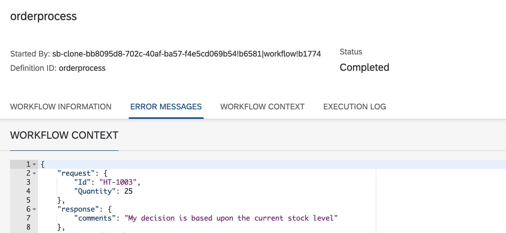
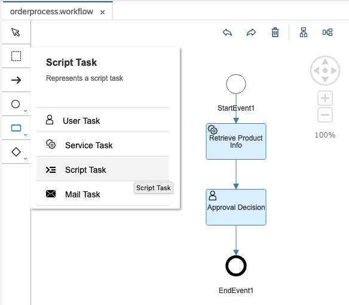
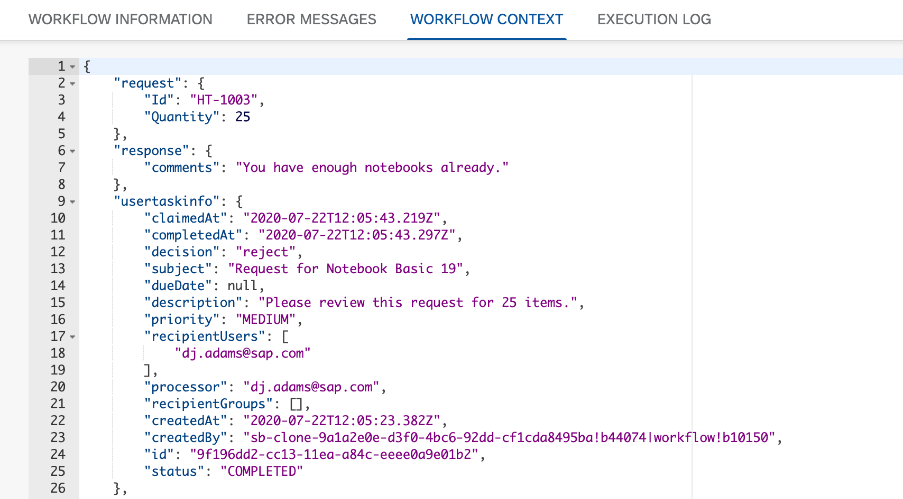

# Exercise 10 - Accessing contextual information in a Script Task

In this exercise you'll add a Script Task to your workflow definition and explore some of the context information available to you in a running workflow instance.

## Steps

After completing these steps you'll have a third task in your workflow definition, and understand how to access contextual information during Script Task execution.

### 1. Review result of User Task activity

In the [last step of the previous exercise](../09#5-try-the-form-out) you entered a comment and selected either the "Approve" or the "Reject" button to complete the task (and thus the workflow instance). In this step you'll check the result of this activity to see what information is available directly in the context via the "Monitor Workflows - Workflow Instances" app.

:point_right: In your Fiori launchpad site, open the "Monitor Workflows - Workflow Instances" app and find the most recent instance (you may have to readjust the filter to show instances in "Completed" status).

:point_right: Look at the Workflow Context of this instance, and check for the comments you entered when processing the task. You should see something like this (in this example, the comment _"My decision is based upon the current stock level"_ was entered):



:point_right: Check elsewhere in the context to find what decision was made - approval or rejection. Can you find that information?

The answer to this question is "no", because it's not there. It's [available in other contextual information that's accessible from Script Tasks](https://help.sap.com/viewer/e157c391253b4ecd93647bf232d18a83/Cloud/en-US/1a25295cfee142dda232ed14a33c8665.html), and via the [Java Unified Expression Language](https://help.sap.com/viewer/e157c391253b4ecd93647bf232d18a83/Cloud/en-US/9f91b1c0fac3414d9cba1015dea381f1.html) that can be used in various parts of workflow definitions, such as expressions for branching based on conditions.

In the following steps we'll use a Script Task to access this information.


### 2. Add a Script Task to the workflow definition

:point_right: Add a Script Task to the workflow definition via the "Tasks" menu in the graphical workflow editor in the SAP Web IDE Full-Stack, as shown. Place the task as the third task item in the flow, to be executed after the "Approval Decision" task:



> Don't forget that you can use the arrangement buttons to tidy up the definition diagram like you did in [Exercise 09](../09#2-add-a-user-task-to-the-definition).

The main purpose of this Script Task is to prepare a message that can eventually be sent to the requestor (the sending of the message will be left as an activity to be completed after this event finishes). So name this Script Task appropriately.

:point_right: Set the "Name" property in the "Script Task Properties" to "Prepare Message".

Script Tasks allow for the execution of logic written in JavaScript and contextual information about the instance in which the execution takes place, as well as metadata about the workflow instance itself, is available through special variables. The JavaScript is contained in files that are associated with the workflow definition.

:point_right: Use the "Create File" link to create a new JavaScript file called `preparemessage.js` - notice where within the workflow project the file is stored.

You're immediately taken into a file editor, with plenty of (commented out) examples of how to access and manipulate an instance's context:

```javascript
/*
// read from existing workflow context
var productInfo = $.context.productInfo;
var productName = productInfo.productName;
var productDescription = productInfo.productDescription;

// read contextual information
var taskDefinitionId = $.info.taskDefinitionId;

// read user task information
var lastUserTask1 = $.usertasks.usertask1.last;
var userTaskSubject = lastUserTask1.subject;
var userTaskProcessor = lastUserTask1.processor;
var userTaskCompletedAt = lastUserTask1.completedAt;

var userTaskStatusMessage = " User task '" + userTaskSubject + "' has been completed by " + userTaskProcessor + " at " + userTaskCompletedAt;

// create new node 'product'
var product = {
    productDetails: productName  + " " + productDescription,
    workflowStep: taskDefinitionId
};

// write 'product' node to workflow context
$.context.product = product;
*/
```

:point_right: Take your time to [stare at](https://langram.org/2019/04/08/es6-reduce-and-pipe/) this code, taking in the three main access points for special information:

- `$.context`: the context itself
- `$.info`: data about the instance
- `$.usertasks`: access to information in User Tasks

:point_right: Below the commented out JavaScript (you may delete it all if you wish) add the following and save the file:

```javascript
$.context.usertaskinfo = $.usertasks.usertask1.last;
```

:point_right: Save the workflow definition (you've saved the Script Task file but you've also made changes to the definition itself, remember) and then follow the usual "build/deploy" flow.

:point_right: Once the deployment is complete, create a new instance using Postman as you've done before.


### 3. Process the User Task and check the context

In this step you'll complete the instance you've just created by leaving a comment and making an approval or rejection decision, and then check that information in the workflow context.

:point_right: In the "My Inbox" app, find the new User Task waiting for you, leave a comment, and make an approval or rejection decision. This should cause the task to disappear, and the workflow instance to run to completion.

:point_right: Now use the "Workflow Monitor - Workflow Instances" app to find that instance that has just run to completion (again, make sure the "Completed" status is selected in the status filter) and examine the Workflow Context. It should look something like this:



In the `usertaskinfo` property you can see that information about the User Task is clearly available, including the decision taken - in this example it was a "rejection".

### 4. Prepare a message appropriate to send to the requester

Armed with the decision information, you can now prepare a message, to be stored in the workflow context, to be eventually sent on to the requester. A Mail Task might be the best way to achieve this, but we won't cover it here.

:point_right: Go back to the SAP Web IDE Full-Stack and into the file editor for the `preparemessage.js` file. Below the line you already have, add the following:

```javascript
var taskinfo = $.usertasks.usertask1.last;
$.context.message = taskinfo.subject
  + " was "
  + (taskinfo.decision === "approve" ? "approved" : "rejected")
  + ". The stock quantity at the time was "
  + $.context.productInfo.d.StockQuantity
  + ".";
```

:point_right: Save the file, and build and redeploy as usual.

Now we're ready for one last instantiation of this workflow definition.

:point_right: Create a new instance with Postman and complete the User Task that appears in the "My Inbox" app. Add a comment and approve or reject as you see fit.

:point_right: Using the "Workflow Monitor - Workflow Instances", find the completed instance and examine the context - you should find a "message" property in there that is appropriate to your decision and to the stock of the product requested. Here's an example of one such message:

**"Request for Notebook Basic 19 was rejected. The stock quantity at the time was 150."**


## Summary

In addition to Service Tasks and User Tasks, you're now familiar with Script Tasks and the information that's available to you during execution of such tasks.

## Questions

1. When looking at the comments in context, they were saved in a property with this path: `/response/comments`. Do you remember where this path came from, where it was specified?

1. In the JavaScript you added to the User Task, what is the significance of the `usertask1` reference?
